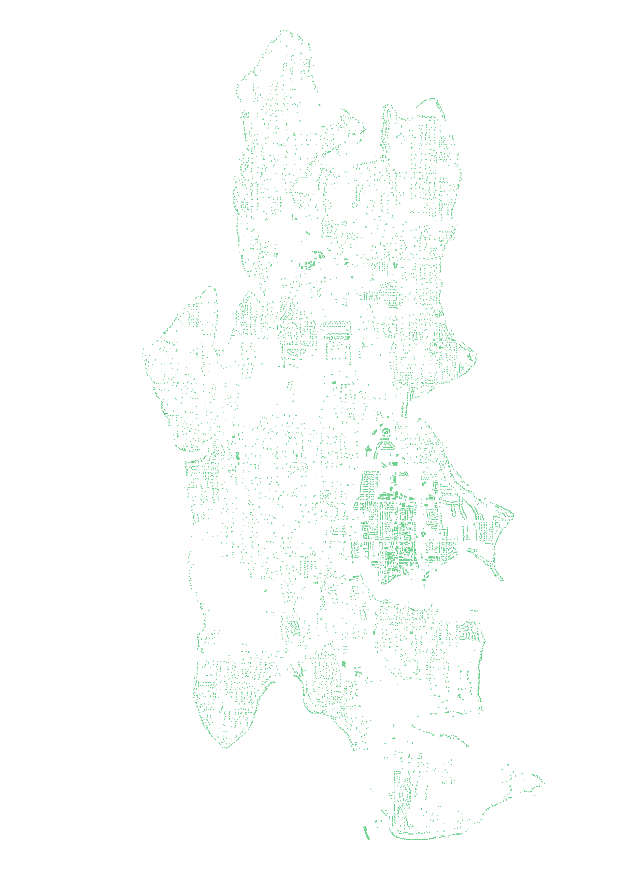
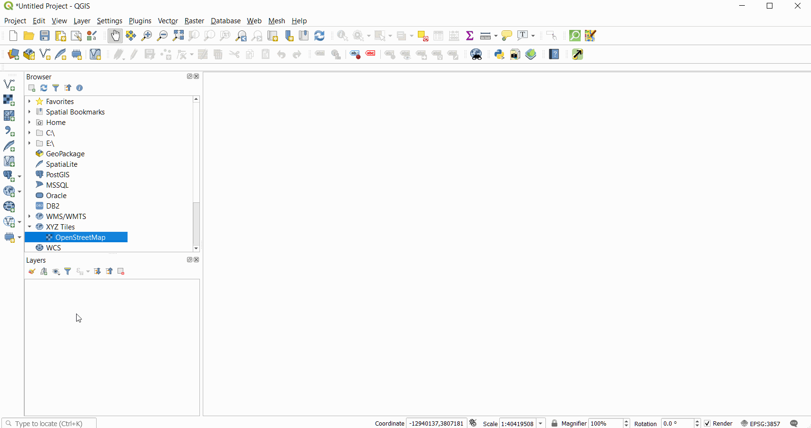
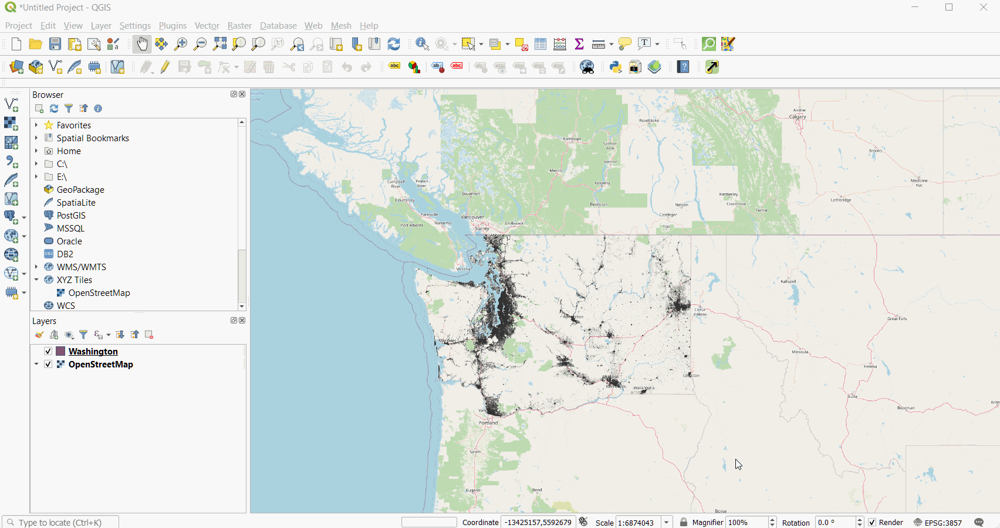
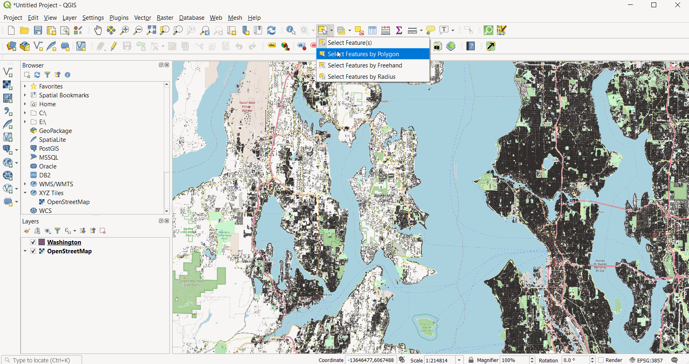
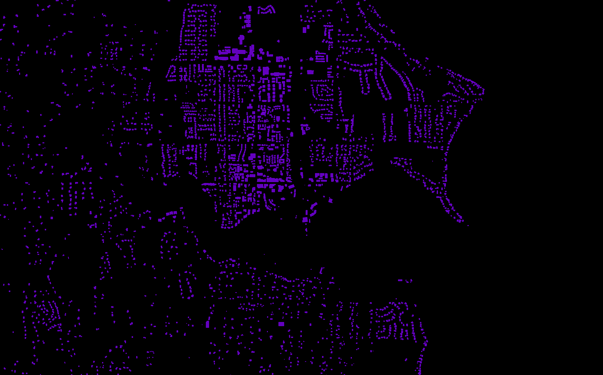
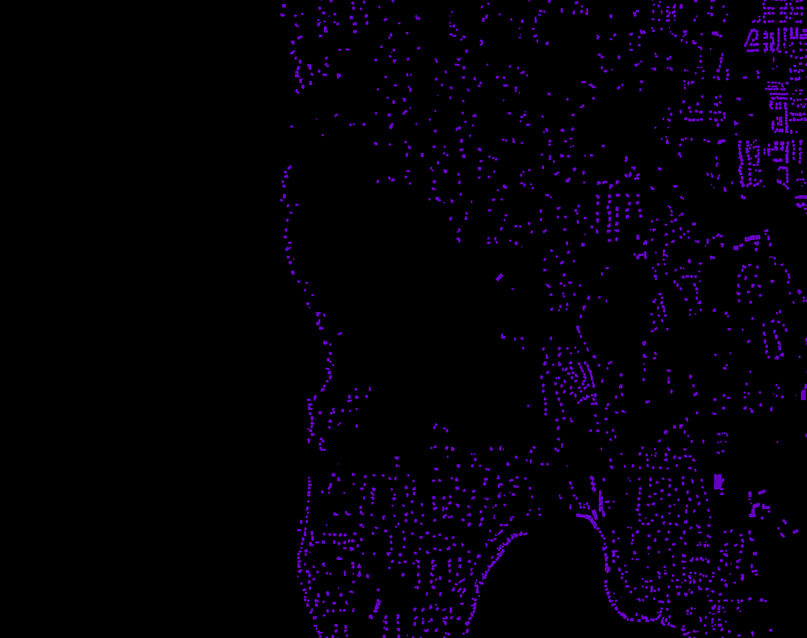

<!-- {::nomarkdown}

{:/} -->

*Bainbridge Island, my hometown.* 

I've always loved maps. The differet ways we represent the physical world on a small screenor piece of paper is fascinating. I could spend hours looking at subway maps, old world maps,or beautiful topo maps. They're such a powerful mix of technical prowess and art (maybe that's why I love photography).

Maps, and other visualizations, are a great way to turn complicated or abstract information intosomething understandable. Early on my journey to learn how to visualize data, I've been inspired by recent works of data journalism, especially from the New York Times.

#### Inspiration

The headline for the 2018 piece [*A Map Of Every Building In America*](https://www.nytimes.com/interactive/2018/10/12/us/map-of-every-building-in-the-united-states.html) definitely caught my eye. After reading through, mesmerized by the tiny black dots, I found [Microsoft's Github pepository](https://github.com/Microsoft/USBuildingFootprints/) of **125,192,184** "computer generated building footprints in all 50 US states." What a fascinating way to see our built environment in clarity, without the clutter which comes fromsatelite images or standard online maps.

#### Process

I'm from Bainbridge Island (near Seattle), so I thought I'd start there. I found [`Washington.zip`](https://usbuildingdata.blob.core.windows.net/usbuildings-v1-1/Washington.zip) file (98 MB zipped, 691 MB unzipped) conveniently listed, downloaded it, and loaded it into QGIS. I turned on a background map (OSM) to help navigate.

There are quite a few features to be rendered (2,993,361 to be exact).

Very new to QGIS (I'm sure there's a better way of doing this), I zoomed into Puget Sound and used the `Select Features by Freehand` tool to select just the polygons (buildings) on Bainbridge Island. Being an island surrounded by water, as all islands tend to be, it was easy to define what was a building on Bainbridge and what wasn't. You can also turn on a background map to help you navigate. Sadly the buildings aren't labeled, unlike how they are in OpenStreetMap.

I then copied these polygons into a new virtual layer and went to artistic "work" simply changing the background color, fill color and border color. I used the same emerald green `#50C878` for both the building fill and border, but put the fill at 75% opacity. Then, in the print layout area, I set the background to transparent and exported it as a `.png`.

Et voilà, it turned out pretty well!

It's interesting to see where the island has been developed, versus where it hasn't. The downtown area is just north of Eagle Harbor, while the void in the middle is Gazzam Lake Nature Preserve.

You can play around with an interactive version using the qgis2web plugin to export it with leaflet [here](/TestMap), in purple.