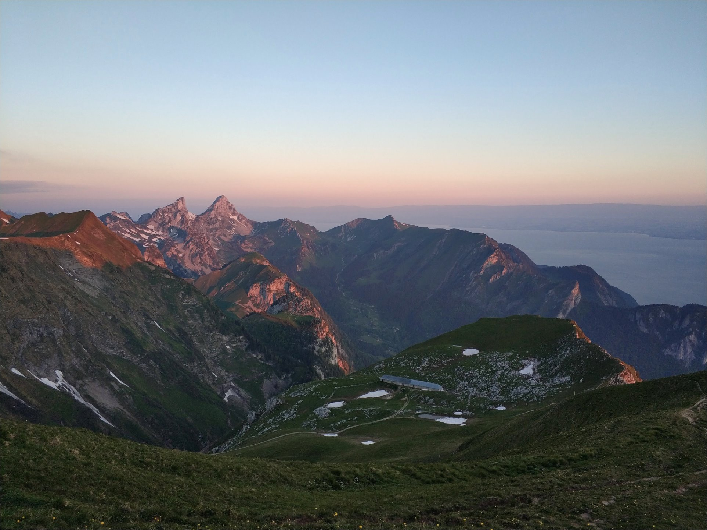
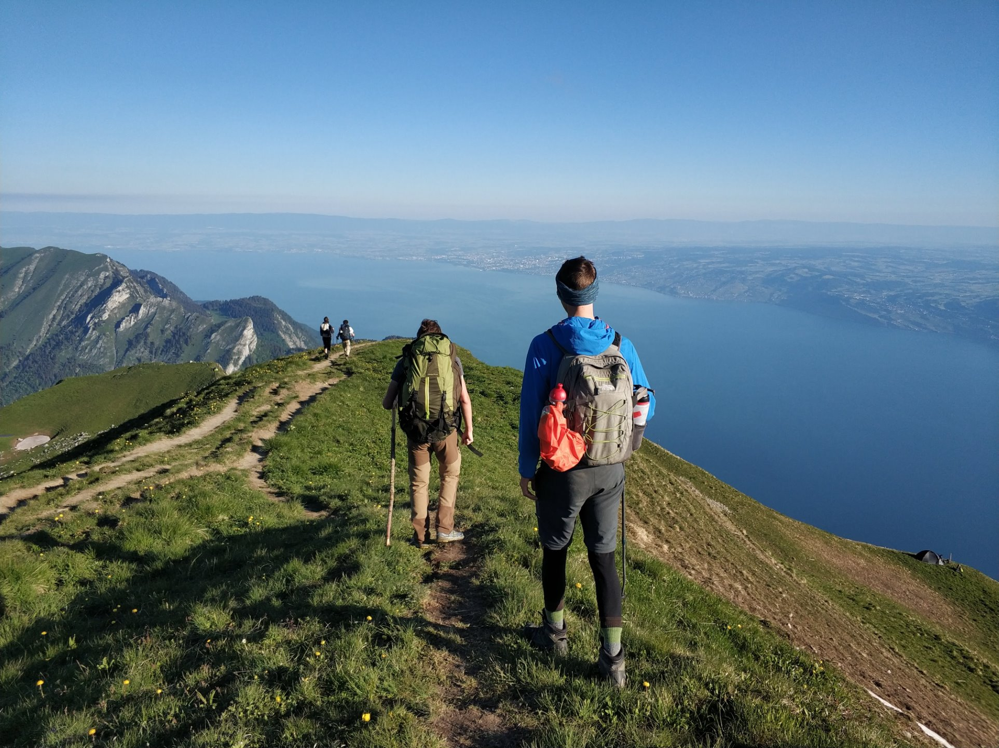

*Written on 12-13 June 2020*

A few weeks after seeing some incredible photos from [this post](https://www.novo-monde.com/en/hike-switzerland-grammont/), Le Grammont was immediately placed in the top spot of my bucket list of hikes to do in Switzerland. Being relatively close to Geneva, this short but steep hike seemed to have it all on paper - a trailhead accessible by public transportation (usually, not during these Covid-19 times though), a lake to stop at a third of the way up, stunning views, breathtaking views, amazing views...let's just say the views were the main calling card.

# Getting There

Switzerland has great public transportation, but being the cheap and crazy master's students that we are, we decided to get there by less-conventional methods - a mixture of biking, driving (for the friends, public transportation for me), and of course, hiking.

With far too much coffee and caffeine coursing through our veins, we set off from Geneva by bike to Lausanne, roughly 60 km away.

<!-- <iframe src="https://ridewithgps.com/embeds?type=trip&id=49814398&metricUnits=true&sampleGraph=true" style="width: 1px; min-width: 100%; height: 500px; border: none;" scrolling="no"></iframe> -->

<iframe src="https://www.komoot.com/tour/201173295/embed?profile=1" width="100%" height="580" frameborder="0" scrolling="no"></iframe>

We met our friends in Lausanne. A nice, hearty portion rice salad in the garden fueled the five of us for the next leg of the trip - sitting on the train and bus (for me), and driving (for them) to the trailhead in Miex, Le Flon, where our hike would begin.

# The Hike

## Day 1: Le Flon - Taney Lake - Le Grammont

<iframe src="https://www.komoot.com/tour/201274418/embed?profile=1" width="100%" height="580" frameborder="0" scrolling="no"></iframe>

### Le Flon to Taney Lake

A quick 35 minutes of moving time and 350m up through a nice wooded trail brought us to the beautiful alpine Taney Lake. This is a very accessible (and very popular) day hike, and for good reason. The short hike up leads hikers to a clear, deep blue lake surrounded by towering peaks and alpine vegetation, with cute and rustic Swiss lodges offering food, drink and a few beds to spend the night. We didn't let these comforts distract us, so we kept on climbing.

### Taney Lake to Le Grammont

The hike up to Le Grammont is relatively straightforward, involving 700m of gradual to moderately-steep elevation gain, which took us about 1 hour and 20 minutes to complete. While relatively straightforward, this segment is incredibly beautiful. It might be the closest place to Geneva where at times, you really feel like your in the center of the alps. The valleys were grand, and we saw several ibex along the way. There were also several fountains in which we could fill up our water bottles.

Once we reached the ridge, it was just 10 more minutes or so before we saw one of the top five views of my life - an indescribably vast and beautiful panoramic view of lac Léman (Lake Geneva). We were truly at a loss of words.

Not imagining the view could get any better, we then pushed on to the summit, Le Grammont. While quite exposed and cold, we decided to spend the night - the view was just too nice to retreat back into the valley. We set up camp, cooked some pasta, and enjoyed one of the best sunset views of my life.

<!-- (SpaceX) -->

## Day 2: Le Grammont - Taney Lake - Le Flon

We woke up just seconds before the sun peaked out from behind the mountains, so we groggily dashed out of our tents to capture it. Once again, the views from the top of Le Grammont didn't disappoint.

A nice, freezing morning of reflection, coffee and running around chasing birds was followed by our departure from the best campsite back down towards civilization.

<iframe src="https://www.komoot.com/tour/201527349/embed?profile=1" width="100%" height="580" frameborder="0" scrolling="no"></iframe>

Our path down was slightly different than the way up. This way had less of a developed trail, and at times had us walking across a grassy field.

We were quickly back at Taney Lake, where we spent half an hour relaxing by the water's edge. While we had all been tempted to swim, clouds rolled in lowering the air temperature, so we decided to pass. The area around the lake was extremely busy - I guess people have discovered this secret spot long ago.

Another quick segment later and we were back at the car. A quick shuttle down the hill and a longer commute back to Lausanne brought us to a lovely homemade lunch and a nice afternoon by the beach. However relaxing it was, we still had a long bike ride back.

<iframe src="https://www.komoot.com/tour/201550894/embed?profile=1" width="100%" height="580" frameborder="0" scrolling="no"></iframe>

We chose to go the slightly longer but more scenic route. It didn't disappoint!

# Conclusion

Le Grammont, at 2172m, is one of the highest points overlooking Lake Geneva, and definitely one of the most beautiful. It was a great overnight trip, and can be extended into a longer trip by incorporating it into [stage 34](https://www.schweizmobil.ch/en/hiking-in-switzerland/routes/route/etappe-01331.html) of the [Alpine Passes Trail](https://www.schweizmobil.ch/en/hiking-in-switzerland/route-06.html) (National Route 6), or beyond.