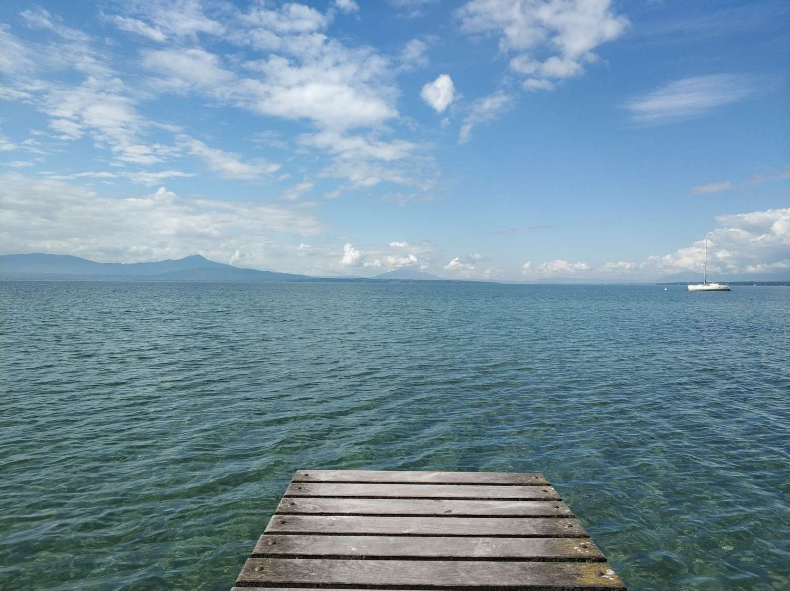

# Summary

- [Intro](https://wrynearson.github.io/geneva-genova/#geneva-to-genova)
- [Preface](https://wrynearson.github.io/geneva-genova/#preface)
- [Day 1: Geneva - Col de Tamiè](https://wrynearson.github.io/geneva-genova/#day-1--geneva---col-de-tami%C3%A8)
- [Day 2: Col de Tamiè - Col du Télégraphie](https://wrynearson.github.io/geneva-genova/#day-2-col-de-tami%C3%A8---col-du-t%C3%A9l%C3%A9graphie)
- [Day 3: Col du Télégraphie - Col Du Galibier - Col d’Izoard](https://wrynearson.github.io/geneva-genova/#day-3-col-du-t%C3%A9l%C3%A9graphie---col-du-galibier---col-dizoard)
- [Day 4: Col d’Izoard - Col d’Agnel](https://wrynearson.github.io/geneva-genova/#day-4-col-dizoard---col-dagnel)
- [Day 5: Col d’Agnel - Castelvecchio di Rocca Barbena](https://wrynearson.github.io/geneva-genova/#day-5-col-dagnel---castelvecchio-di-rocca-barbena)
- [*Break in Castelvecchio*](https://wrynearson.github.io/geneva-genova/#break-in-castelvecchio)
- [Day 6: Castelvecchio di Rocca Barbena - Celle](https://wrynearson.github.io/geneva-genova/#day-6-castelvecchio-di-rocca-barbena---celle)
- [Day 7: Celle - Genova](https://wrynearson.github.io/geneva-genova/#day-7-celle---genova)
- [Conclusion](https://wrynearson.github.io/geneva-genova/#conclusion)

~relive video below~

<div class="embedly-responsive" style="position: relative;padding-bottom: 78.2227%;height: 0;overflow: hidden;"><iframe class="embedly-embed" frameborder="0" scrolling="no" allowfullscreen src="https://cdn.embedly.com/widgets/media.html?src=https://www.relive.cc/view/vrqD4ryrmLq/widget?r=embed-site&url=https://www.relive.cc/view/vrqD4ryrmLq?r=embed-site&image=https://www.relive.cc/view/vrqD4ryrmLq/png?x-ref=embed-site&key=f1631a41cb254ca5b035dc5747a5bd75&type=text/html&schema=relive" width="1024" height="801" style="position: absolute;top: 0;left: 0;width: 100%;height: 100%;"></iframe></div>

~relive video above~

# Preface

Any story written in 2020 must be prefaced with COVID-19. Our story is no exception. 

Francesco and I had met through our shared masters program in Geneva in the autumn of 2019, and instantly began thinking of outdoor excursions to do in our vicinity. While we both enjoy hiking and skiing, Francesco's main outdoor calling is cycling. I've always been comfortable on a bike, and had completed an ill-prepared but thoroughly enjoyable monthlong trip across the North Island of New Zealand in 2014, but had never considered myself a cyclist. Heck, the closest thing I had ever owned to a road bike was a single speed / fixie Schwinn with drop handlebars during my undergraduate studies.

Francesco, on the other hand, was more at home on the saddle. Having grown up in Genova, Liguria :it: , he had gone on several trips with his cycling uncle during his formative years, and had some time riding on carbon fiber under his belt. Being in Switzerland after all, famously home to not only beautiful mountain passes and lush landscapes, but also perfectly paved roads, cycling was definitely on his list of things to do there.

In March, after COVID-19 restrictions came into effect essentially freeing the roads of cars, plus a few fun but excruciating rides on my piece of crap city bike, I upgraded to a house-brand aluminum bike, and our training began. Or so we realized in hindsight, since really we just started riding frequently around the *Grand Genève* region. Our weekly rides of several dozen kilometers quickly turned into longer and thrice-weekly rides which ventured into neighboring *canton Vaud*. Little did I know that Francesco was going almost daily.


[(../assets/img/2020-07-14-geneva-genova/mont-tendre.jpg)

Later that Spring, we starting dreaming of bigger, further, and more adventurous rides. We did an overnight 'bike to hike' camping trip, and then a full circuit of lake Geneva, *tour du lac* `219km` .  At this point we planned a 2 day (really 2.5 day) Rhône Route `310km` trip *(trip report in the future)* with another willing accomplice, Johan, and then our first truly daring adventure, a trip home for him to Genova.




At `524km` and `8007m` of elevation gain, this trip headed SSE from Switzerland through France and into Italy before ending on the Mediterranean. This trip passed through 12 cols (mountain passes), including the famous *Col Du Galibier* in France and *Col d'Agnel* on the French/Italian border. We took a break in a tiny village in which Francesco's family has accommodation to meet his family and our friends before continuing to his home town. 

Let the trip begin!

# Geneva to Genova

<iframe src="https://ridewithgps.com/embeds?type=trip&id=60752612&title=Geneva%20to%20Genova&metricUnits=true&sampleGraph=true&privacyCode=CtroDikKQJ35pKJF" style="width: 1px; min-width: 100%; height: 700px; border: none;" scrolling="no"></iframe>

## Day 1:  Geneva - Col de Tamiè

<iframe src="https://ridewithgps.com/embeds?type=trip&id=60752974&title=Day%201%3A%20Geneva%20-%20Col%20de%20Tami%C3%A8&metricUnits=true&sampleGraph=true&privacyCode=jhdM6pm8guZgonT1" style="width: 1px; min-width: 100%; height: 700px; border: none;" scrolling="no"></iframe>

### Notes

```
- Johan, Fra and Will started in the early afternoon, due to packing and logistics with friends and family.
  - Francesco's last day in Geneva!
- Went to Annecy first, we were excited but the road and traffic condition wasn't great.
- We arrived at 17:30, and took advantage of our first accomplishment with a tour of the beautiful city and a large dinner filled with beer and cheese.
- Post-dinner ride along the gorgeous lake and cycling path with dramatic skies and full stomachs.
- Planned on arriving before dark, but made it to the lesser-known Col de Tamiè `907m` at 22:30 and set up camp due to photo stops and bathroom emergencies.
  - We assumed it was in the middle of nowhere, but was next to a touristic restaurant and livestock.
```

## Day 2: Col de Tamiè - Col du Télégraphie

<iframe src="https://ridewithgps.com/embeds?type=trip&id=60752997&title=Day%202%3A%20Col%20de%20Tami%C3%A8%20-%20Col%20du%20T%C3%A9l%C3%A9graphie&metricUnits=true&sampleGraph=true&privacyCode=Sg3dGh2Jtt7j7YO6" style="width: 1px; min-width: 100%; height: 700px; border: none;" scrolling="no"></iframe>

	### Notes

```
- Francesco, Johan and Will enjoyed mellow descents and chirping birds in the forest.
- A sketchy and dirty bar for breakfast (with coffee).
- We were contemplating master's thesis decisions, and Fra joined in on a Zoom call with his Matrix Bluetooth glasses.
- Blasted Led Zeppelin to get up to a nice picnic spot.
- Had a "biker's special" lunch in La Chambre
- Dropped off Johan at Saint-Jean-de-Maurienne
- Before our final planned ascension to Col du Télégraphie, Fra realized he needed to pee (a frequent realization on bike trips)
  - He went into a modern bakery *Le Frui'Thé*.
  - Once seeing the nice selection, we decided to quickly fuel up fuel :fuelpump:
  - After talking briefly about our trip, the owner offered us a few extras - a few pastries and raspberry tarts.
  - Upon seeing our starved gaze, she continued to empty her shop to fill our box of free goodies. We were beyond elated.
- Our fuel up proved helpful - we reached the top of the call around 21:00, with plenty of light left.
- Upon realizing our targeted sleeping spot (a what we assumed to be an abandoned castle) was in fact an active military base, we descended into Valloire and reluctantly paid 10 euros for a flat piece of grass and warm showers. We needed this for our following three days of insanity.
```

## Day 3: Col du Télégraphie - Col Du Galibier - Col d'Izoard

<iframe src="https://ridewithgps.com/embeds?type=trip&id=60752996&title=Day%203%3A%20Col%20du%20T%C3%A9l%C3%A9graphie%20-%20Col%20Du%20Galibier%20-%20Col%20d%E2%80%99Izoard&metricUnits=true&sampleGraph=true&privacyCode=dIdWZHUxS7TR0swm" style="width: 1px; min-width: 100%; height: 700px; border: none;" scrolling="no"></iframe>

- An unexplainably slow start to the day (finishing the pastries, shower, pack, 2nd breakfast in Valloire) meant the most famous climb was done in the heat of the day.
- Our start at roughly 12:00 lead to us dripping with sweat, and filling our brains with doubt, almost instantly.
- This discomfort quickly turned into awe as we gazed upon some of the most stunning mountain landscapes we had ever seen. Despite the heat, the perfect weather also put us in good spirits.
- A steady pace, infrequent photo breaks, and friendly competition brought us to the top of Col Du Galibier ```2642m```. We enjoyed ourselves on the top, and were overwhelmed by the beauty of the place. 
- We decided to rest and wait for the mid-afternoon heat to pass, so we found a park in Briançon and relaxed for a few hours. 
  - We made ourselves so comfortable that one man felt obliged to tell us that camping wasn't allowed in this city park.
- At around 19:00 (with plenty of light), we commenced our second intense climb of the day - Galibier wasn't enough!
- Despite some increasingly severe neck pain for me (Will), the beautiful evening light and serene mountain conditions put us in a meditative state.
- The sunset at roughly 21:30 knocked us out of this meditation and gave us motivation to continue the gorgeous ascent on perfect tarmac.
  - Lugers were taking advantage of the good conditions and near-zero car traffic, so much so that they almost collided with us!
- A dusk photo under the summit monument gave us an earned sense of accomplishment.
- We hiked up another 20m to a flat patch of land and slept soundly.

<video src="../assets/img/2020-07-14-geneva-genova/galibier1.mp4"></video>

<video src="../assets/img/2020-07-14-geneva-genova/galibier2.mp4"></video>

## Day 4: Col d'Izoard - Col d'Agnel

<iframe src="https://ridewithgps.com/embeds?type=trip&id=60752994&title=Day%204%3A%20Col%20d%E2%80%99Izoard%20-%20Col%20d%E2%80%99Agnel&metricUnits=true&sampleGraph=true&privacyCode=ILoKgTjwORgvqHEG" style="width: 1px; min-width: 100%; height: 700px; border: none;" scrolling="no"></iframe>

- A sound evening and gorgeous morning lead to a fantastic (and cold) decent of roughly `1000m` into the gorgeous heart of the *Parc naturel régional du Queyras*.
- We reached a fork in the road and decided to pause for a few minutes.
  - Just then, our next encounter would change the trip entirely.
  - Our original plan was to do two cols (NAME).
  - We saw an older man bike from our intended direction towards the other fork in the road. He told us about the beauty and terror that is Col d'Agnel `2744m`, a full 1400m above our fork in the road.
  - It sounded crazy, but after 10 minutes of deliberation, we committed to conquering it.
- After lunch in a quaint village at the base of the climb, we spent the next 3 hours grinding our chains and pedals to get to what felt like the top of the world.
  - This was an absolute beast of a col, but one of rugged, almost otherworldly beauty.
  - Two 700m climbs of 7-13% gradient were split almost equally with a reprieve 0-2% incline.
  - Quaint villages and grasslands below gave way to rugged peaks and narrow roads up above. What stayed constant was the unrelenting sun turning us into lobsters, as any sunscreen was quickly sweated away.
  - The final push to the top was (for Will) a true test of mental grit and determination. Several times, I (Will) thought that the unending road was insurmountable.
  - With just a few hundred meters to go and the col in sight, we both put our heads down and went all out in the thinning air.
  - The emotions we felt, combined with the views, were simply indescribable. Such jagged mountains and vibrant vegetation shouldn't be possible to coexist!
  - We savored the moment, the look back across our traversed terrain in France, and peered into our upcoming adventures in Italy.
- The next 15km were pure joy - steep, straight descents into pure beauty. Despite the poor road conditions and reckless camper vans, we couldn't help ourselves from trying to set land speed records.
- We ended our descent early in the day in Pontechianale and treated ourselves to as many Italian specialties as we could fit in our stomachs.

## Day 5: Col d'Agnel - Castelvecchio di Rocca Barbena

<iframe src="https://ridewithgps.com/embeds?type=trip&id=60752995&title=Day%205%3A%20Col%20d%E2%80%99Agnel%20-%20Castelvecchio%20di%20Rocca%20Barbena&metricUnits=true&sampleGraph=true&privacyCode=M5A539q86ZX73LKE" style="width: 1px; min-width: 100%; height: 700px; border: none;" scrolling="no"></iframe>

- Got one of our earliest start (at 8.40 :smile:) after breakfast at the bakery (+ sweets for the rest of the day in a paper bag) and packing
- 50 km long unending relentless descent on with _suboptimal_ road conditions (flying mats) with a coffee break in a gas station in Sepeyre
- Our next segment was disciplined by necessity, as we needed to make it to Castelvecchio by the evening. Steady pace at around 30 km/h in the _Pianura padana_ with infrequent water breaks while the temps were rising 
- Well-deserved lunch  at 13 in Mondovì: two plates of pasta, prosciutto e melone and caprese (+ chinotto)
- After seriously considering to swim in the public fountain, despite the 32º we set off on a few baby cols
- The heat and the gradient instantly negated the fuel from our lunch 
- Water and people were scarce: it took time to find someone to ask to refill our bottles (lady and cleaning lady)
- After the first baby col we found ourselves struggling in the heat near _località Fornaci_, on 15-20% roads 
- To reward our efforts, we treated ourselves to icecream and iced tea and gassosa in Bagnasco: the last serious climb of the day, on top of which we would meet Michele
- Last 30 km went like a breeze, with Michele setting the pace like two stranded swimmers being towed back to the beach from the sea, drinking water from the spring in Calizzano 
- Last but not least: _Colle dello Scravaion_. Pure joy and sense of victory. Francesco was screaming to let go of all the effort, fatigue and adrenaline. 
- On our final descent, we looked at what was maybe the best view of the trip. Our family and friends waiting for us and a big dinner. 

### Break in Castelvecchio

*Friends, family, food, adventure, hikes, chilling, my birthday, and everything else that's good in life*. 

<iframe src="https://ridewithgps.com/embeds?type=trip&id=60753069&title=Colle%20di%20Caprauna%20Birthday%20Ride&metricUnits=true&sampleGraph=true&privacyCode=e0whdQI9TBrzr9lQ" style="width: 1px; min-width: 100%; height: 700px; border: none;" scrolling="no"></iframe>

---

## Day 6: Castelvecchio di Rocca Barbena - Celle

<iframe src="https://ridewithgps.com/embeds?type=trip&id=60752993&title=%20Day%206%3A%20Castelvecchio%20di%20Rocca%20Barbena%20-%20Celle&metricUnits=true&sampleGraph=true&privacyCode=XqPoen1fbg2cArTp" style="width: 1px; min-width: 100%; height: 700px; border: none;" scrolling="no"></iframe>

- Our quick pit stop in Castelvecchio turned into a week of pure joy and recovery, both mentally and physically. Still, we managed to get in a 87 km ride with 2300+ meters of elevation for Will's birthday, together with Michele. 
- We descended towards Celle passing through Balestrino and Capo Noli
- We arrived in Celle for lunch and for a swim - chilling with Nonna 

## Day 7: Celle - Genova

<iframe src="https://ridewithgps.com/embeds?type=trip&id=60752992&title=Day%207%3A%20Celle%20-%20Genova&metricUnits=true&sampleGraph=true&privacyCode=5tyziRvNuXyK3FVa" style="width: 1px; min-width: 100%; height: 700px; border: none;" scrolling="no"></iframe>

- Nice ride for the first half on the cycling way next to the sea and then some traffic dodging 
- With the end in sight, we raced through traffic to get to Francesco's home town and finish the journey (actually, only half of it

# Conclusion

Amazing ride!