In July 2020, a friend and I biked 524km from Geneva to Genova through France. We pushed ourselves to our limits, and had an unforgettable and incredible adventure as a result.

| Table of Contents                                            |
| :----------------------------------------------------------- |
| [Preface](https://wrynearson.github.io/geneva-genova/#preface) |
| [Day 1: Geneva - Col de Tamiè](https://wrynearson.github.io/geneva-genova/#day-1--geneva---col-de-tami%C3%A8) |
| [Day 2: Col de Tamiè - Col du Télégraphie](https://wrynearson.github.io/geneva-genova/#day-2-col-de-tami%C3%A8---col-du-t%C3%A9l%C3%A9graphie) |
| [Day 3: Col du Télégraphie - Col Du Galibier - Col d’Izoard](https://wrynearson.github.io/geneva-genova/#day-3-col-du-t%C3%A9l%C3%A9graphie---col-du-galibier---col-dizoard) |
| [Day 4: Col d’Izoard - Col d’Agnel](https://wrynearson.github.io/geneva-genova/#day-4-col-dizoard---col-dagnel) |
| [Day 5: Col d’Agnel - Castelvecchio di Rocca Barbena](https://wrynearson.github.io/geneva-genova/#day-5-col-dagnel---castelvecchio-di-rocca-barbena) |
| [*Break in Castelvecchio*](https://wrynearson.github.io/geneva-genova/#break-in-castelvecchio) |
| [Day 6: Castelvecchio di Rocca Barbena - Celle](https://wrynearson.github.io/geneva-genova/#day-6-castelvecchio-di-rocca-barbena---celle) |
| [Day 7: Celle - Genova](https://wrynearson.github.io/geneva-genova/#day-7-celle---genova) |
| [Conclusion](https://wrynearson.github.io/geneva-genova/#conclusion) |

<div class="embedly-responsive" style="position: relative;padding-bottom: 78.2227%;height: 0;overflow: hidden;"><iframe class="embedly-embed" frameborder="0" scrolling="no" allowfullscreen src="https://cdn.embedly.com/widgets/media.html?src=https://www.relive.cc/view/vrqD4ryrmLq/widget?r=embed-site&url=https://www.relive.cc/view/vrqD4ryrmLq?r=embed-site&image=https://www.relive.cc/view/vrqD4ryrmLq/png?x-ref=embed-site&key=f1631a41cb254ca5b035dc5747a5bd75&type=text/html&schema=relive" width="1024" height="801" style="position: absolute;top: 0;left: 0;width: 100%;height: 100%;"></iframe></div>

## Preface

Any story written in 2020 must be prefaced with COVID-19. Our story is no exception. 

Francesco and I had met through our shared masters program in Geneva in the autumn of 2019, and instantly began thinking of outdoor excursions to do in our vicinity. While we both enjoy hiking and skiing, Francesco's main outdoor calling is cycling. I've always been comfortable on a bike, and had completed an ill-prepared but thoroughly enjoyable month-long trip across the North Island of New Zealand in 2014, but had never considered myself a cyclist. Heck, the closest thing I had ever owned to a road bike was a single speed / fixie Schwinn with drop handlebars during my undergraduate studies.

Francesco, on the other hand, was more at home on the saddle. Having grown up in Genova, he had gone on several trips with his cycling uncle during his formative years, and had some time riding on carbon fiber under his belt. Being in Switzerland after all, famously home to not only beautiful mountain passes and lush landscapes, but also perfectly paved roads, cycling was definitely on his list of things to do there.

In March, after COVID-19 restrictions came into effect essentially freeing the roads of cars, plus a few fun but excruciating rides on my piece of crap city bike, I upgraded to a house-brand aluminum bike, and our training began. Or so we realized in hindsight, since really we just started riding frequently around the *Grand Genève* region. Our weekly rides of several dozen kilometers quickly turned into longer and thrice-weekly rides which ventured into neighboring *canton Vaud*. Little did I know that Francesco was going almost daily.

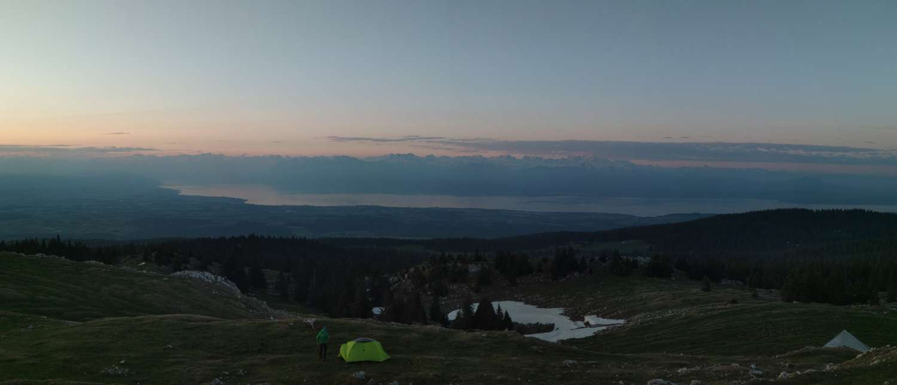

Later that Spring, we starting dreaming of bigger, further, and more adventurous rides. We did an overnight 'bike to hike' camping trip, and then a full circuit of lake Geneva, *tour du lac* `219km` .  At this point we planned a 2 day (really, 2.5 day) Rhône Route `310km` trip *(trip report in the future)* with another willing accomplice, Johan, and then our first truly daring adventure, a trip home for him to Genova.


At `524km` and `8007m` of elevation gain, this trip headed SSE from Switzerland through France and into Italy before ending on the Mediterranean. This trip passed through 12 cols (mountain passes), including the famous *Col Du Galibier* in France and *Col d'Agnel* on the French/Italian border. We took a break in a tiny village in which Francesco's family has accommodation to meet his family and our friends before continuing to his home town. 

Let the trip begin!

## Geneva to Genova

<iframe src="https://ridewithgps.com/embeds?type=trip&id=60752612&title=Geneva%20to%20Genova&metricUnits=true&sampleGraph=true&privacyCode=CtroDikKQJ35pKJF" style="width: 1px; min-width: 100%; height: 700px; border: none;" scrolling="no"></iframe>

## Day 1:  Geneva - Col de Tamiè

<iframe src="https://ridewithgps.com/embeds?type=trip&id=60752974&title=Day%201%3A%20Geneva%20-%20Col%20de%20Tami%C3%A8&metricUnits=true&sampleGraph=true&privacyCode=jhdM6pm8guZgonT1" style="width: 1px; min-width: 100%; height: 700px; border: none;" scrolling="no"></iframe>

Excitement was in the air when we set off in the early afternoon. It was Francesco's last day in Geneva, so on top of the normally complex logistics of packing for a bike trip was the fact that he had to move out at the same time. With the house cleaned and adventure calling, we set off.

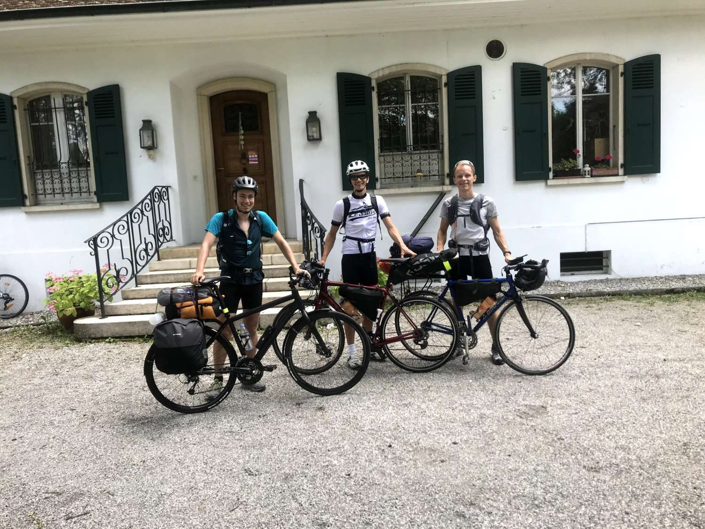

We almost immediately crossed into France. With our sights set on Annecy for dinner and our bikes being in good shape (so far), we pushed through with barely any stops. The landscape was nice, but the constant traffic and mediocre bike lane detracted from the experience. Spirits were high, however, since we knew cycling nirvana was ahead.

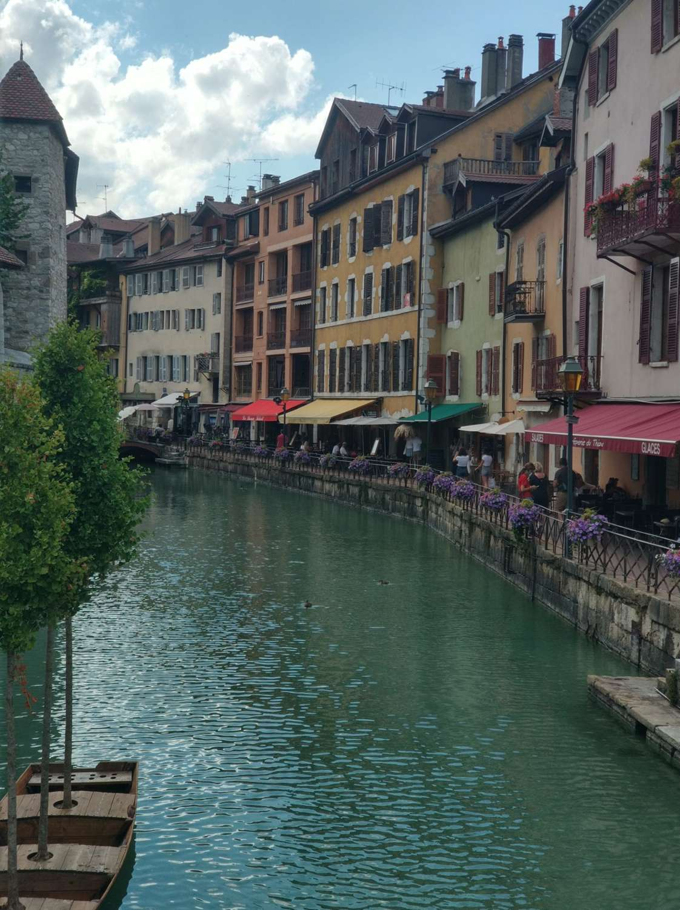

Beautiful Annecy at sunset further improved our mood. Beautiful cheese and beers did so even more.

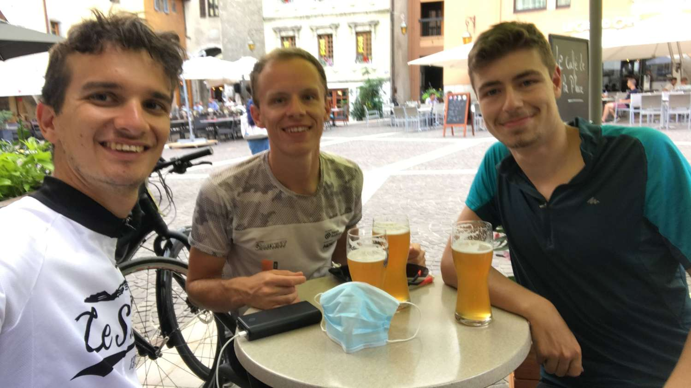

We felt far too accomplished for only cycling for a few hours, and thus spent too much time in the city. Once the beers and food wore off (which took a while), we enjoyed the wonderful landscape and separated cycling path along *lac d'Annecy* during dusk. 

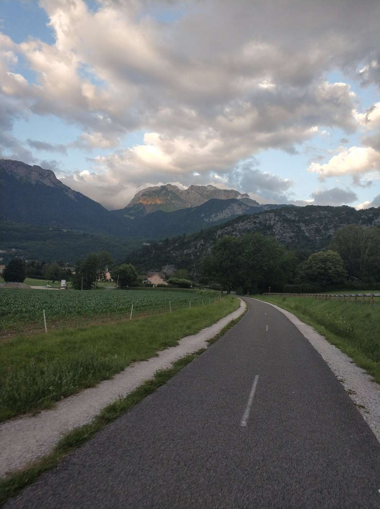

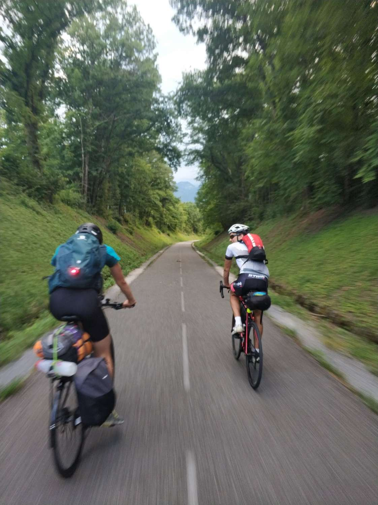

The calm, speedy route continued into mellow climbs with minimal traffic. Dusk turned to twilight, which turned into the black of night. We only arrived to the unknown *col de tamiè* at around 23:00.


We pitched our tent in a grass field and promptly went to bed, dreaming on the days to come.

### Notes

```markdown
- Johan, Fra and Will started in the early afternoon, due to packing and logistics with friends and family.
  - Francesco's last day in Geneva!
- Went to Annecy first, we were excited but the road and traffic condition wasn't great.
- We arrived at 17:30, and took advantage of our first accomplishment with a tour of the beautiful city and a large dinner filled with beer and cheese.
- Post-dinner ride along the gorgeous lake and cycling path with dramatic skies and full stomachs.
- Planned on arriving before dark, but made it to the lesser-known Col de Tamiè `907m` at 22:30 and set up camp due to photo stops and bathroom emergencies.
  - We assumed it was in the middle of nowhere, but was next to a touristic restaurant and livestock.
```

## Day 2: Col de Tamiè - Col du Télégraphie

<iframe src="https://ridewithgps.com/embeds?type=trip&id=60752997&title=Day%202%3A%20Col%20de%20Tami%C3%A8%20-%20Col%20du%20T%C3%A9l%C3%A9graphie&metricUnits=true&sampleGraph=true&privacyCode=Sg3dGh2Jtt7j7YO6" style="width: 1px; min-width: 100%; height: 700px; border: none;" scrolling="no"></iframe>

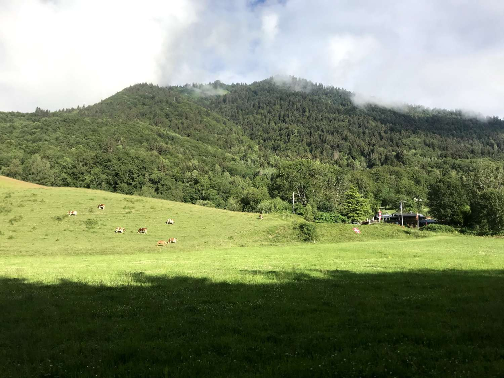

The wonderful thing about sleeping at the top of a *col* is that a chill descent is always the first part of your ride the next day. We enjoyed one though a forest with chirping birds, followed by a *café au lait* in a sketchy bar.

The following morning ride was lovely but not memorable - not because of a lack of scenery, but because Francesco and I had some important decisions to make for our master's program. COVID-19 was making our planned move to Beijing in September uncertain, so we had some decisions to make. Our cyclist-friendly solution: utilize the remote working skills from the spring to call into a zoom meeting while cycling.

Afterwards, and with thoughts of future life plans in the front of our heads, we climbed through forested roads and took breaks at opportunistic viewpoints. We continued into the quaint town of *La Chambre* and ate more good food and drank more good beer.

Johan, our crazy athletic friend, kept our pace despite having a slower bike and fewer bike trips under his belt (albeit only one less than me). However, he decided shortly before leaving Geneva that he would only join us for the first two days. He, along with several of our friends, had planned a long-distance hike in the Dolomites just a few days after our planned arrival, so he didn't want to risk time or injury by competing the full bike trip with us. Thus, we dropped him off at *Saint-Jean-de-Maurienne* where he rode the train back to Geneva.

Sad but determined, Francesco and I pushed on into the heart of this part of the alps, and the heart of our adventure. Before our first big *col* of the trip, *Col du Télégraphie* `1566m`, we filled up on sweets from a wonderful bakery and owner (see the notes below).


The climb was steep and tough, being our first main one. The thought of unknown landscapes drove us up this *col*, and many others - we reached the top around 21:00. Since we couldn't find a descent place to wild camp, we splurged on a campground with a shower at the bottom of our final descent of the day, and the start of the most famous climb of our trip.

### Notes

```markdown
- Francesco, Johan and Will enjoyed mellow descents and chirping birds in the forest.
- A sketchy and dirty bar for breakfast (with coffee).
- We were contemplating master's thesis decisions, and Fra joined in on a Zoom call with his Matrix Bluetooth glasses.
- Blasted Led Zeppelin to get up to a nice picnic spot.
- Had a "biker's special" lunch in La Chambre
- Dropped off Johan at Saint-Jean-de-Maurienne
- Before our final planned ascension to Col du Télégraphie, Fra realized he needed to pee (a frequent realization on bike trips)
  - He went into a modern bakery *Le Frui'Thé*.
  - Once seeing the nice selection, we decided to quickly fuel up
  - After talking briefly about our trip, the owner offered us a few extras - a few pastries and raspberry tarts.
  - Upon seeing our starved gaze, she continued to empty her shop to fill our box of free goodies. We were beyond elated.
- Our fuel up proved helpful - we reached the top of the call around 21:00, with plenty of light left.
- Upon realizing our targeted sleeping spot (a what we assumed to be an abandoned castle) was in fact an active military base, we descended into Valloire and reluctantly paid 10 euros for a flat piece of grass and warm showers. We needed this for our following three days of insanity.
```

## Day 3: Col du Télégraphie - Col Du Galibier - Col d'Izoard

<iframe src="https://ridewithgps.com/embeds?type=trip&id=60752996&title=Day%203%3A%20Col%20du%20T%C3%A9l%C3%A9graphie%20-%20Col%20Du%20Galibier%20-%20Col%20d%E2%80%99Izoard&metricUnits=true&sampleGraph=true&privacyCode=dIdWZHUxS7TR0swm" style="width: 1px; min-width: 100%; height: 700px; border: none;" scrolling="no"></iframe>

We took our time getting up, showering and packing. This was a huge mistake. The beautiful sunny morning turned into a scorching mid-morning. By then, we pushed onwards up the famed *Col Du Galibier* `2642m`, an unbelievably beautiful but brutal climb, made worse by our slow-moving decision.

Our start at roughly 12:00 lead to us dripping with sweat, and filling our brains with doubt, almost instantly. The main problem is that there is essentially zero shade on the entire climb. We took short breaks on the shady side of immovable objects, but this too was limited due to the angle of the sun directly above us.

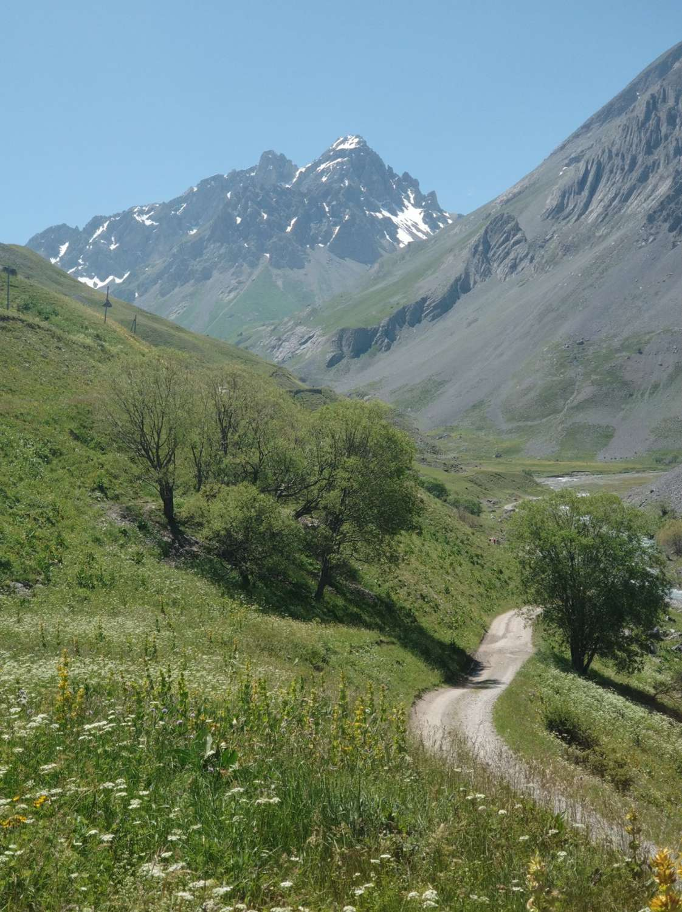

The scenery, once again, propelled us upwards.

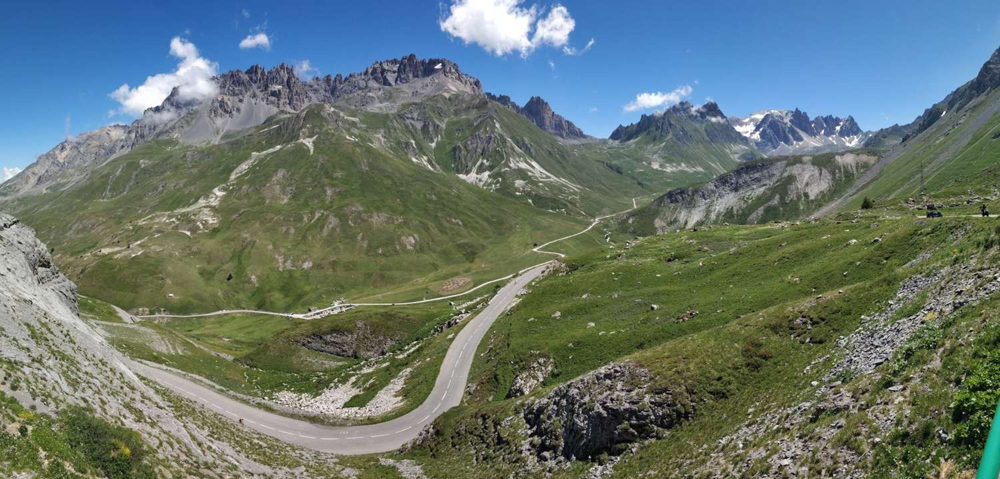

We stopped quickly roughly two thirds of the way up to refill our bottles and our inspiration from the scenery which surrounded us.

The closer we got to the top, the more it pulled us uphill. With perfect conditions, several cameramen, and friendly competition, we reached the *col*.

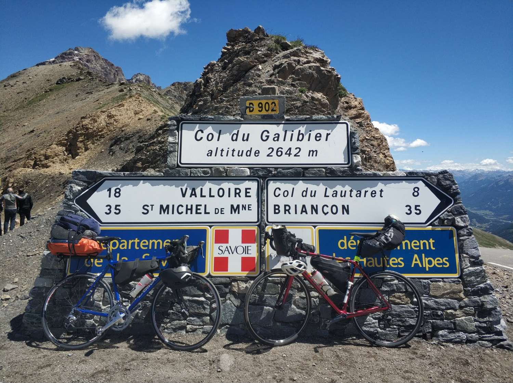

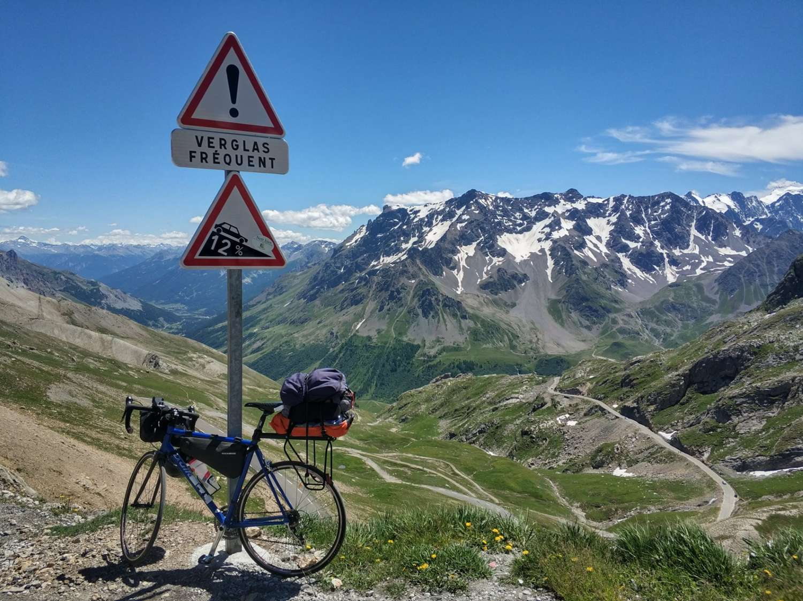

This was the first point in the trip where we felt truly accomplished. We stayed for a while to just take it all in. Then, satisfied, we got what we had earned - an amazing descent.

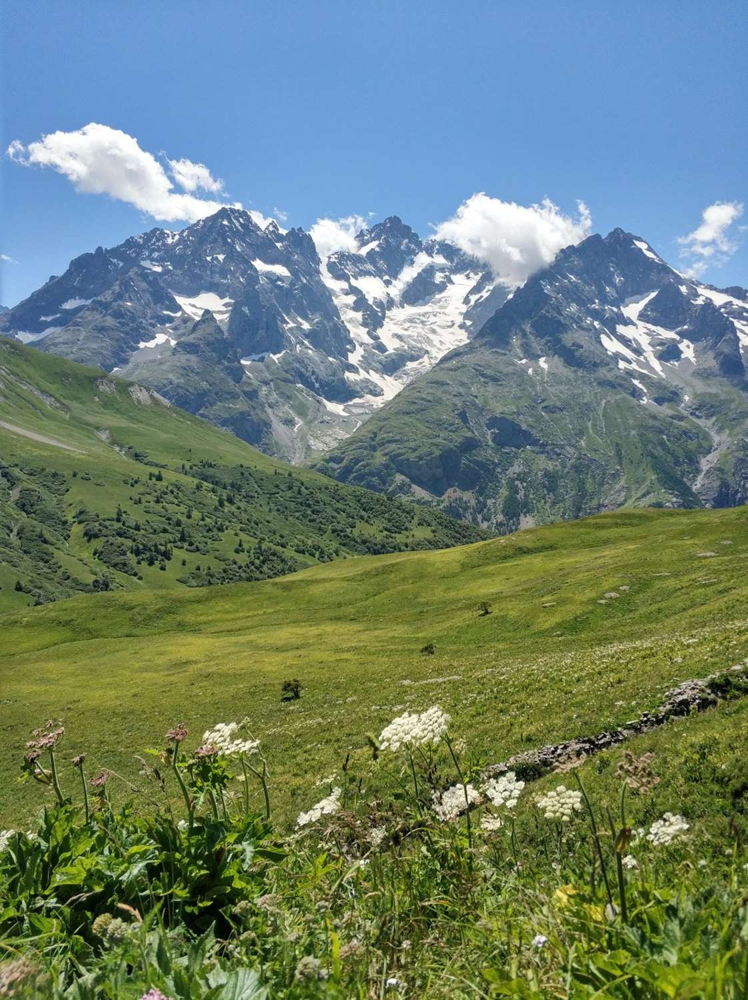

Most people would stop after such a *col* and such an achievement. However, we did not. While I'm very proud of my previous adventures, Francesco deserves all of the credit for planning such crazy, but achievable ones. Thus, we marched on for our second major climb of the day - *Col d'Izoard* `2360m`, almost as high as where we were when we realized we'd have to summit twice on the same day.

After an incredible and long descent on smooth asphalt, we rested in a park in *Briançon* and had a late lunch there, gear, clothes and food spread out on the grass. The feeling was fantastic, just laying there with good French ingredients on a warm summer afternoon. But as with life, and especially with bike adventures, no emotion lasts forever. Around 19:00, we set off for our second climb of the day.

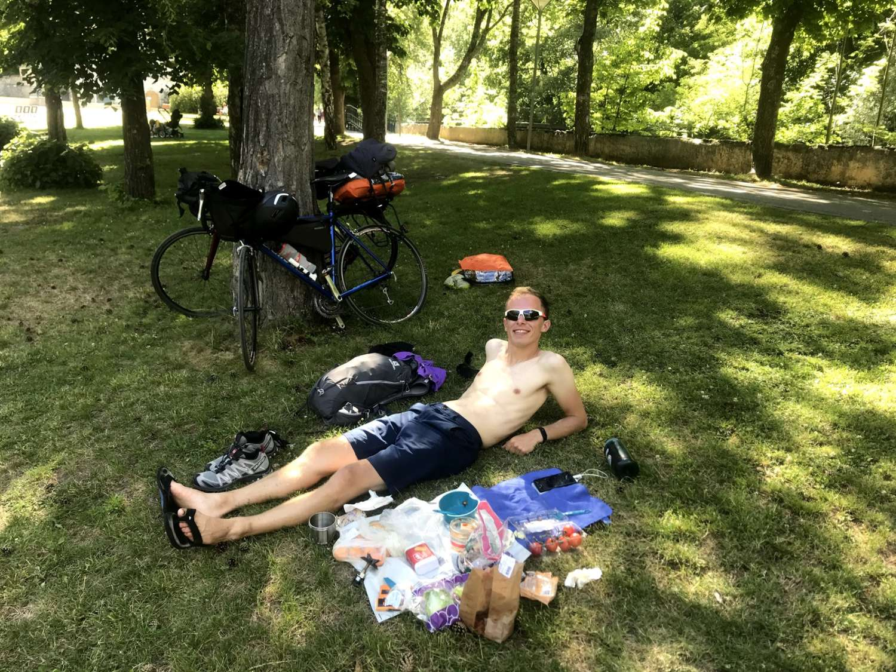

This trip, in all its splendidness, was also painful at times. I sometimes have neck pain, from what I assume was an injury playing American Football in high school. The long, locked posture of clutching handlebars and supporting body weight with shoulders proved to be a disaster for my neck, which was really painful on the descents and later into the day. The climb was excruciating at first, but some stretches and breaks proved a respite from the pain, at least long enough to make some progress upwards.

The pain slowly morphed into pleasure as the sun began to set behind the mountains. While *Galibier* was epic, it was also busy. The climb up to *Izoard* was almost deserted. The pine trees, painted sky and perfect asphalt made it an unexpected gem of our trip, and reminded me of the Rockies in North America, where I did my undergraduate studies.

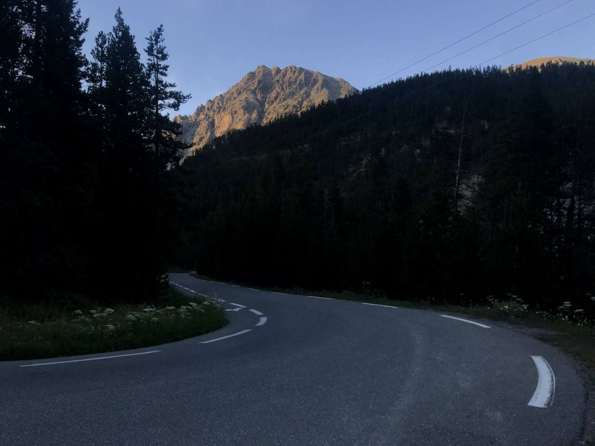

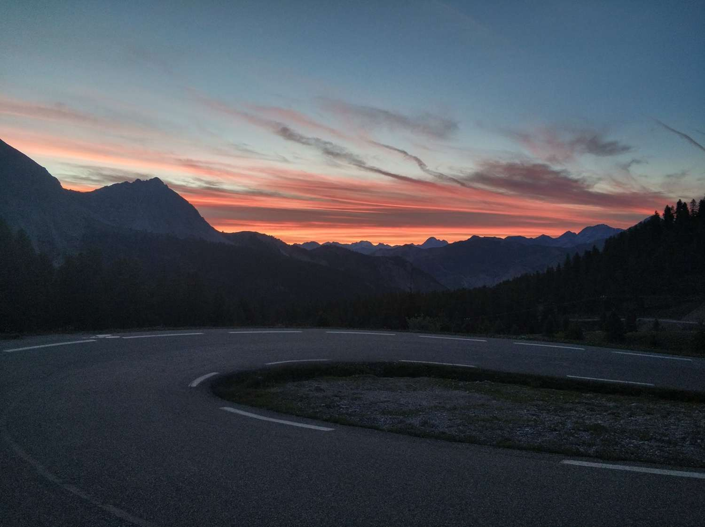

I'm sure we had some fatigue climbing up, and probably stressed about something at the time, but all of these negative emotions fade with time. What matters is the climb was beautiful, and that we were on an adventure of a lifetime. Oh, and that we made it to the top and camped nearby.

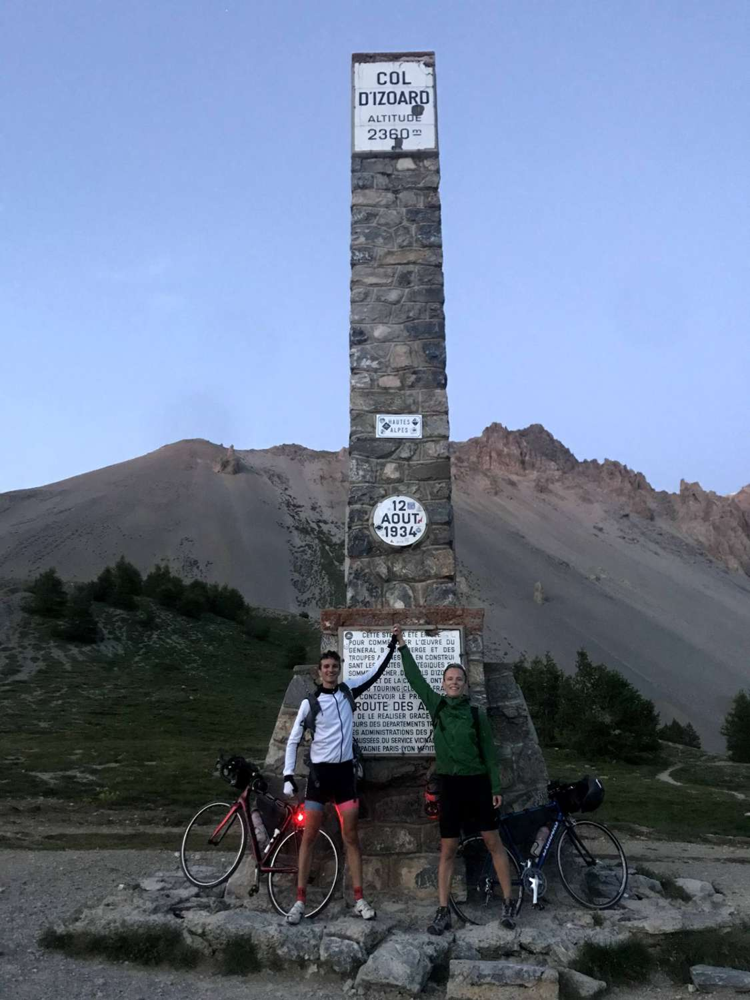

### Notes

```markdown
- An unexplainably slow start to the day (finishing the pastries, shower, pack, 2nd breakfast in Valloire) meant the most famous climb was done in the heat of the day.
- Our start at roughly 12:00 lead to us dripping with sweat, and filling our brains with doubt, almost instantly.
- This discomfort quickly turned into awe as we gazed upon some of the most stunning mountain landscapes we had ever seen. Despite the heat, the perfect weather also put us in good spirits.
- A steady pace, infrequent photo breaks, and friendly competition brought us to the top of Col Du Galibier `2642m`. We enjoyed ourselves on the top, and were overwhelmed by the beauty of the place. 
- We decided to rest and wait for the mid-afternoon heat to pass, so we found a park in Briançon and relaxed for a few hours. 
  - We made ourselves so comfortable that one man felt obliged to tell us that camping wasn't allowed in this city park.
- At around 19:00 (with plenty of light), we commenced our second intense climb of the day - Galibier wasn't enough!
- Despite some increasingly severe neck pain for me (Will), the beautiful evening light and serene mountain conditions put us in a meditative state.
- The sunset at roughly 21:30 knocked us out of this meditation and gave us motivation to continue the gorgeous ascent on perfect tarmac.
  - Lugers were taking advantage of the good conditions and near-zero car traffic, so much so that they almost collided with us!
- A dusk photo under the summit monument gave us an earned sense of accomplishment.
- We hiked up another 20m to a flat patch of land and slept soundly.
```

## Day 4: Col d'Izoard - Col d'Agnel

<iframe src="https://ridewithgps.com/embeds?type=trip&id=60752994&title=Day%204%3A%20Col%20d%E2%80%99Izoard%20-%20Col%20d%E2%80%99Agnel&metricUnits=true&sampleGraph=true&privacyCode=ILoKgTjwORgvqHEG" style="width: 1px; min-width: 100%; height: 700px; border: none;" scrolling="no"></iframe>

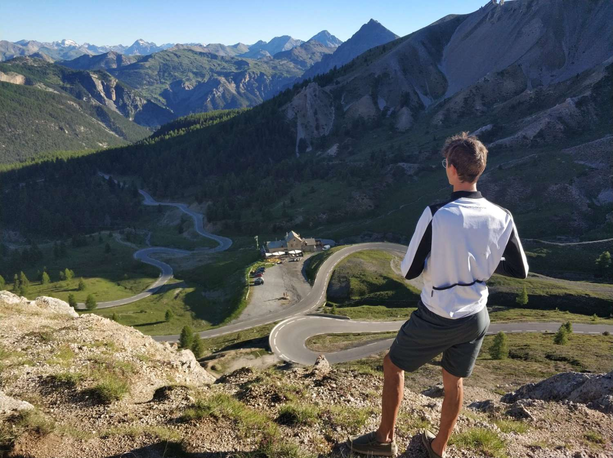

The gorgeously calm morning gave us no sense of the excruciating climb in store for us later. We were up early, and left early, since our campground was exactly in the middle of a touristic viewpoint. The early sun, followed by the nearly `1000m` of frigid descent into *Parc naturel régional du Queyras*, woke us up.

At the bottom of this descent was a metaphor in real life - a T intersection, where we had to choose to turn left or right. We decided to pause for a few minutes to check our maps. Like in life, sometimes the most influential decisions barely register on in our consciousness. We casually contemplated either turning right, as originally planned, and climbing two sizable cols before crossing into Italy. As we were seeing where turning left would take us, an older man came from the right and towards the left. He told us about the beauty and terror that was to our left and is *Col d'Agnel* `2744m`, a full `1400m` the fork. We pretended to discuss our options, but we both already knew that we'd be turning left.

After lunch in a quaint village at the base of the climb, we spent the next 3 hours grinding our chains and pedals to get to what felt like the top of the world. This was an absolute beast of a col, but one of rugged, almost otherworldly beauty. Two `700m` climbs of 7-13% gradient were split almost equally with a reprieve of a few kilometers at a 0-2% incline. Quaint villages and grasslands below gave way to rugged peaks and narrow roads up above. What stayed constant was the unrelenting sun turning us into lobsters, as any sunscreen quickly sweat away. 

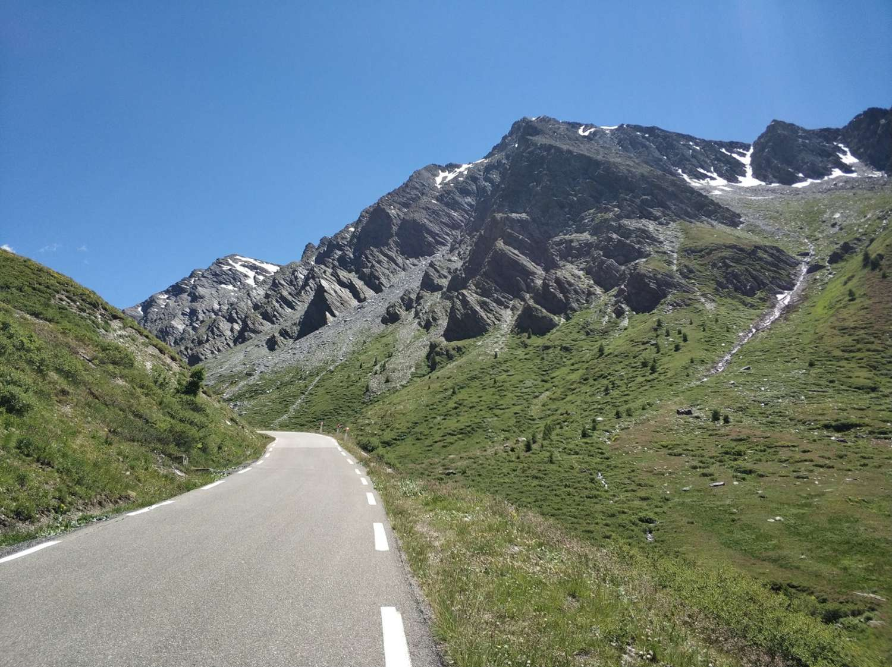


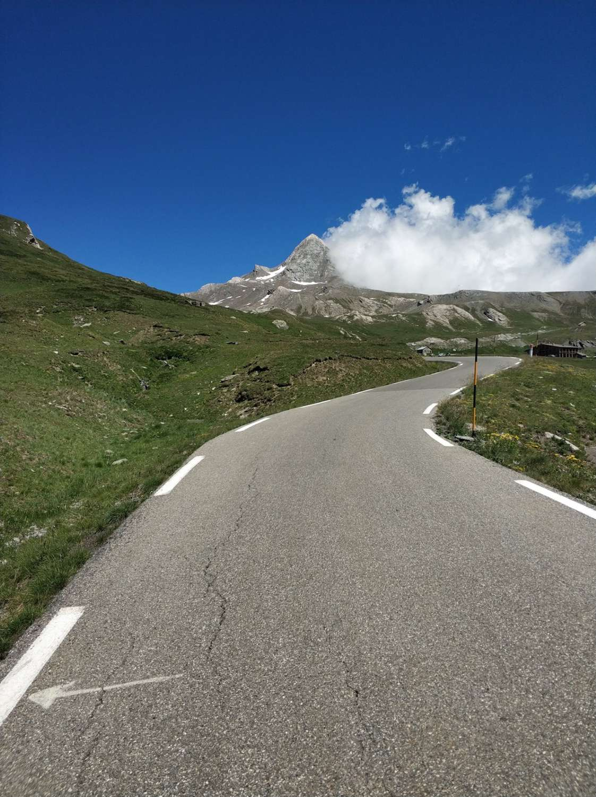

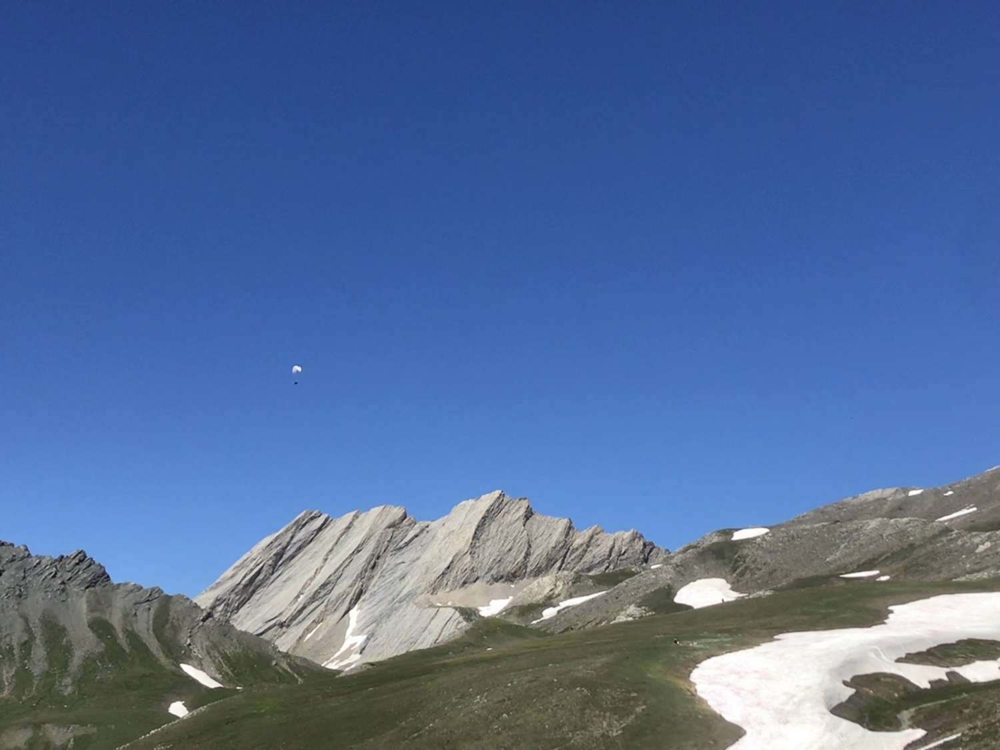

The final push to the top was a true test of mental grit and determination. Several times, I thought that the unending road was insurmountable. There's a reason this section of the report is short - my brain didn't think about anything more verbose than getting to the top.

Somehow, we made it.

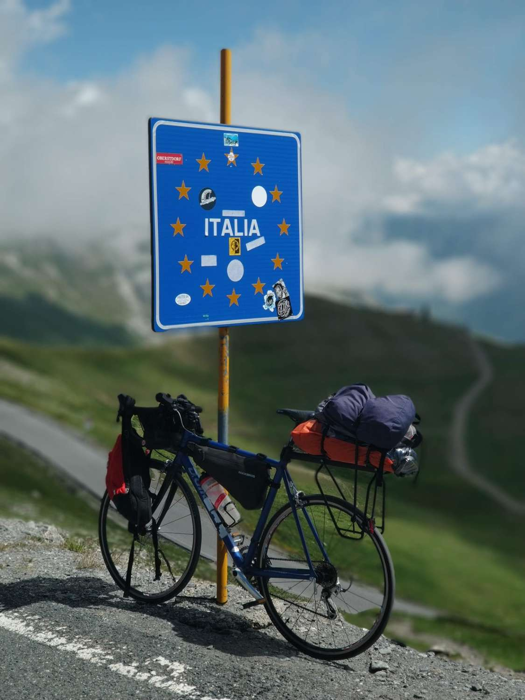

The emotions we felt, combined with the views, were simply indescribable. Such jagged mountains and vibrant vegetation shouldn't be possible to coexist! 

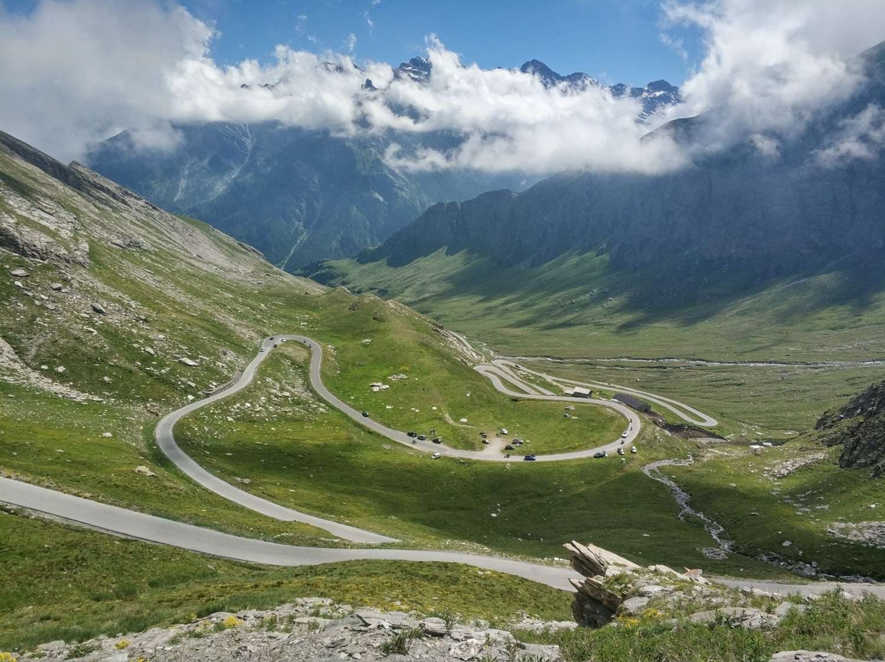

We savored the moment, the look back across our traversed terrain in France, and peered into our upcoming adventures in Italy. I have seen quite a few beautiful landscapes and vistas, but this was one special.

The final 15km descent of the day was beautiful and wonderful, but also intense since the road was filled with potholes and the descent angle was well over 10%. That, and the long straight descents made racing so tantalizing but so risky.

We stopped early in *Pontechianale* to enjoy the perfect weather, emotions and gelato.

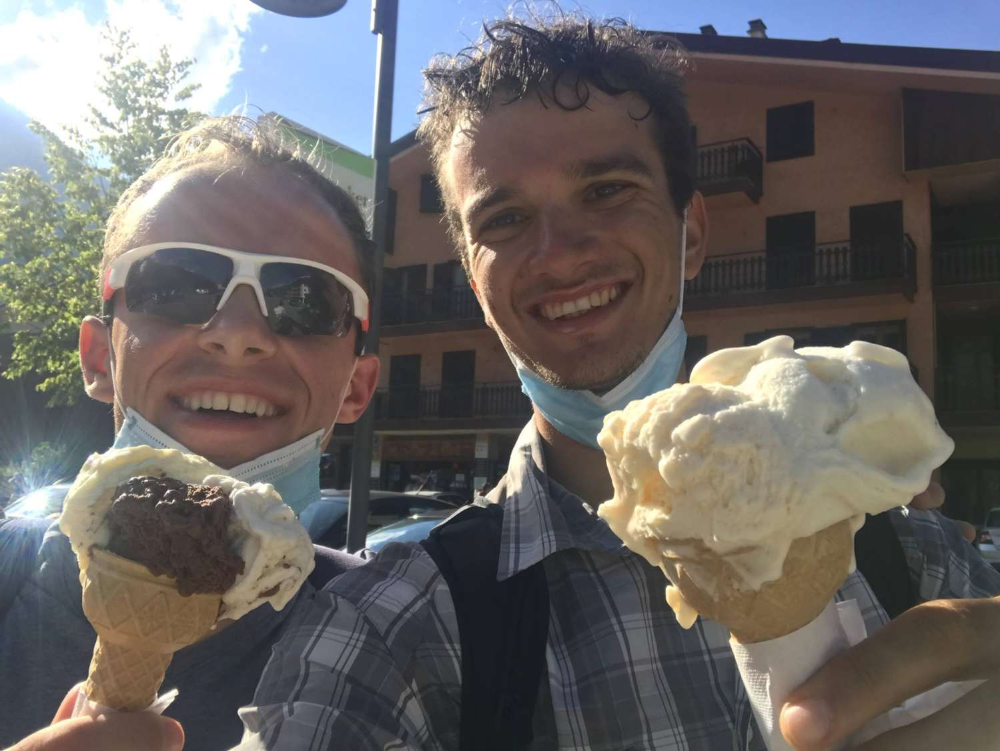

### Notes

```markdown
- A sound evening and gorgeous morning lead to a fantastic (and cold) decent of roughly `1000m` into the gorgeous heart of the *Parc naturel régional du Queyras*.
- We reached a fork in the road and decided to pause for a few minutes.
  - Just then, our next encounter would change the trip entirely.
  - Our original plan was to do two cols (NAME).
  - We saw an older man bike from our intended direction towards the other fork in the road. He told us about the beauty and terror that is Col d'Agnel `2744m`, a full 1400m above our fork in the road.
  - It sounded crazy, but after 10 minutes of deliberation, we committed to conquering it.
- After lunch in a quaint village at the base of the climb, we spent the next 3 hours grinding our chains and pedals to get to what felt like the top of the world.
  - This was an absolute beast of a col, but one of rugged, almost otherworldly beauty.
  - Two 700m climbs of 7-13% gradient were split almost equally with a reprieve 0-2% incline.
  - Quaint villages and grasslands below gave way to rugged peaks and narrow roads up above. What stayed constant was the unrelenting sun turning us into lobsters, as any sunscreen was quickly sweated away.
  - The final push to the top was (for Will) a true test of mental grit and determination. Several times, I (Will) thought that the unending road was insurmountable.
  - With just a few hundred meters to go and the col in sight, we both put our heads down and went all out in the thinning air.
  - The emotions we felt, combined with the views, were simply indescribable. Such jagged mountains and vibrant vegetation shouldn't be possible to coexist!
  - We savored the moment, the look back across our traversed terrain in France, and peered into our upcoming adventures in Italy.
- The next 15km were pure joy - steep, straight descents into pure beauty. Despite the poor road conditions and reckless camper vans, we couldn't help ourselves from trying to set land speed records.
- We ended our descent early in the day in Pontechianale and treated ourselves to as many Italian specialties as we could fit in our stomachs.
```

## Day 5: Col d'Agnel - Castelvecchio di Rocca Barbena

<iframe src="https://ridewithgps.com/embeds?type=trip&id=60752995&title=Day%205%3A%20Col%20d%E2%80%99Agnel%20-%20Castelvecchio%20di%20Rocca%20Barbena&metricUnits=true&sampleGraph=true&privacyCode=M5A539q86ZX73LKE" style="width: 1px; min-width: 100%; height: 700px; border: none;" scrolling="no"></iframe>

If the word motivation described our ride yesterday, the word of the day today was grit.

An early start and incredibly long descent (50km!) was already not easy due to the heat, the condition of my neck, and the terrible road conditions. We only afforded ourselves a 10 minute coffee break next to a petrol station before turning our minds off and our leg muscles on, as for the next several hours, we averaged 30 km/h through hot, flat, unforgiving terrain.

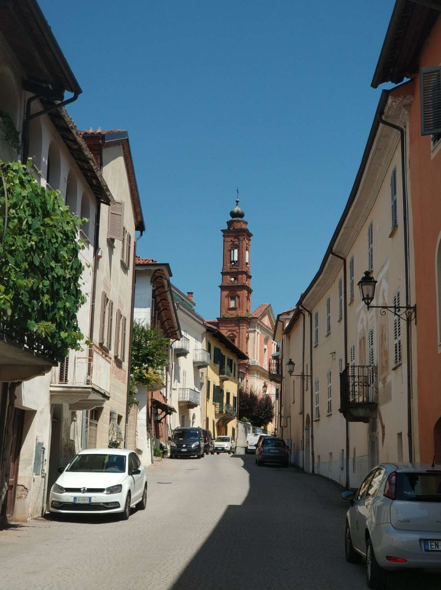

Our fuel stop for lunch in *Mondovi* lead to several baby cols. The amount we were sweating seemed like we climbed *col d'Agnel* all over again, as the 32°C heat, humidity and sunshine felt like we were in an oven.

Later it got worse, as we climbed several 15-20% roads and passed through *località Fornaci* - the furnace.

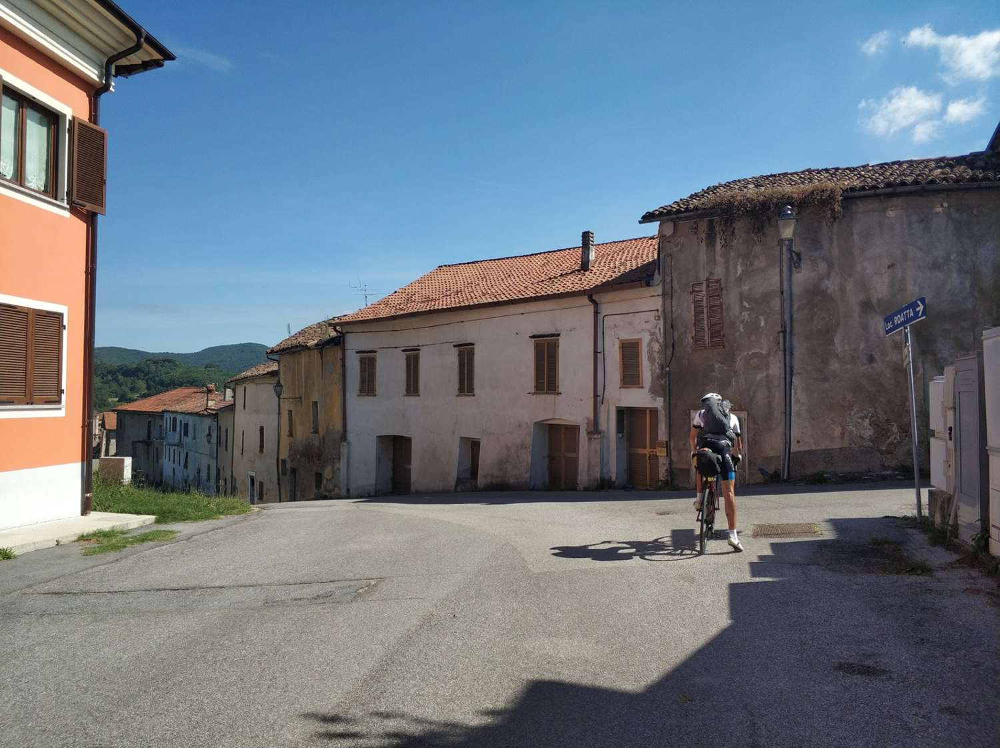

Today was short on photos and memories, as we had only one thing on our mind - meeting our friends, and Francesco's family, in *Castelvecchio di Rocca Barbena*. Since a mutual friend had claimed it was home to the best bar in the world, we were determined to get there and celebrate, and rest.

One final ice cream break in *Bagnasco* in a dive bar, and then one final col on our own before we would be guided to victory by Francesco's uncle Michele (another cycling enthusiast).

I really don't remember that climb, but I remember when we made it to the top and saw Michele waiting for us. We were so drained, but so close that our spirits then rose after seeing him. We had one more "false flat" to push through. It's crazy how much control the mind has over the body. We flew through the final col of the trip, and saw our majestic descent into *Castelvecchio*.

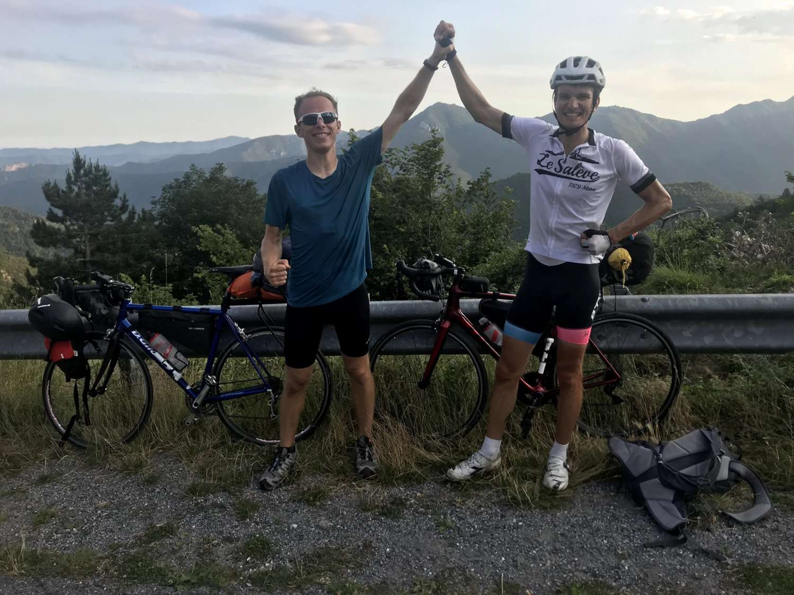


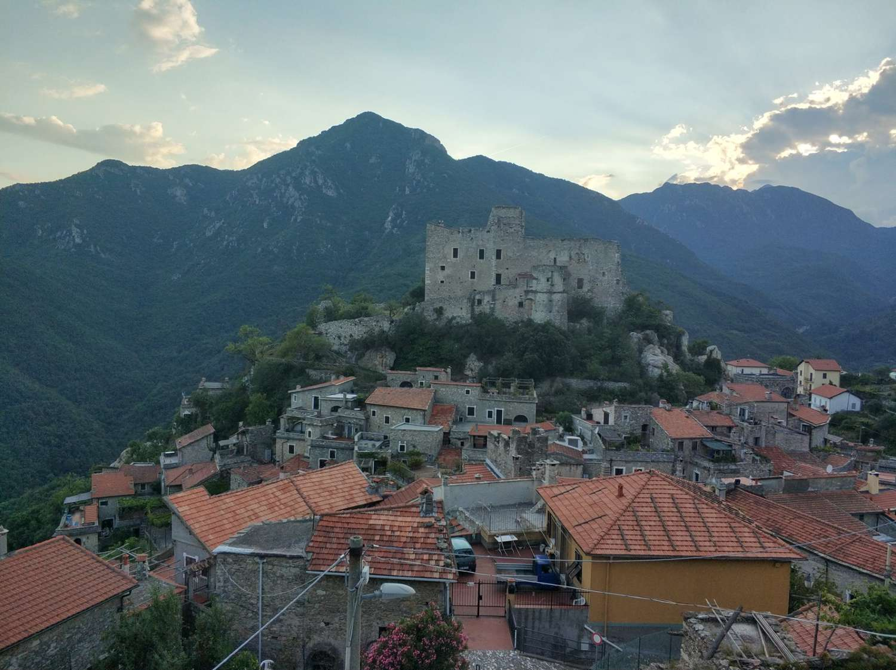


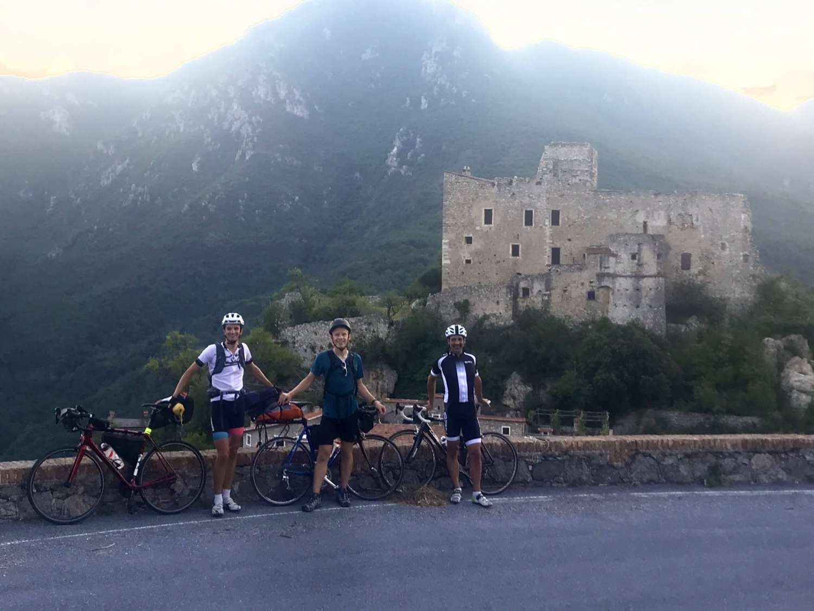

With family and friends waiting, and 470km behind us, we knew we made it to the main destination (even if it wasn't the final one).

### Notes

```markdown
- Got one of our earliest start (at 8.40) after breakfast at the bakery (+ sweets for the rest of the day in a paper bag) and packing
- 50 km long unending relentless descent on with *suboptimal* road conditions (flying mats) with a coffee break in a gas station in Sepeyre
- Our next segment was disciplined by necessity, as we needed to make it to Castelvecchio by the evening. Steady pace at around 30 km/h in the _Pianura padana_ with infrequent water breaks while the temps were rising 
- Well-deserved lunch  at 13 in Mondovì: two plates of pasta, prosciutto e melone and caprese (+ chinotto)
- After seriously considering to swim in the public fountain, despite the 32º we set off on a few baby cols
- The heat and the gradient instantly negated the fuel from our lunch 
- Water and people were scarce: it took time to find someone to ask to refill our bottles (lady and cleaning lady)
- After the first baby col we found ourselves struggling in the heat near *località Fornaci*, on 15-20% roads 
- To reward our efforts, we treated ourselves to icecream and iced tea and gassosa in Bagnasco: the last serious climb of the day, on top of which we would meet Michele
- Last 30 km went like a breeze, with Michele setting the pace like two stranded swimmers being towed back to the beach from the sea, drinking water from the spring in Calizzano 
- Last but not least: _Colle dello Scravaion_. Pure joy and sense of victory. Francesco was screaming to let go of all the effort, fatigue and adrenaline. 
- On our final descent, we looked at what was maybe the best view of the trip. Our family and friends waiting for us and a big dinner. 
```

## Break in Castelvecchio

Friends, family, food, adventure, hikes, chilling, my birthday, and everything else that's good in life.

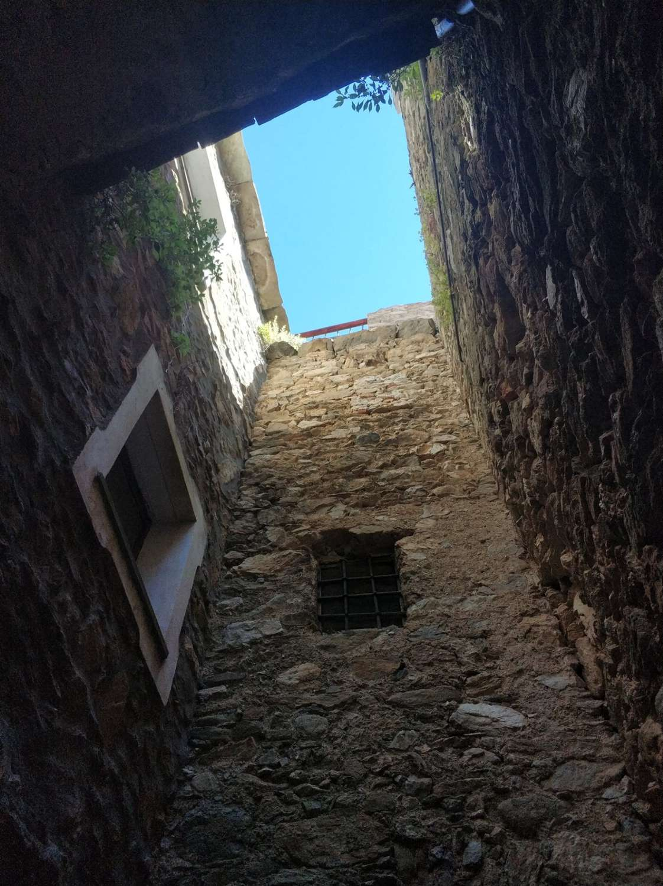


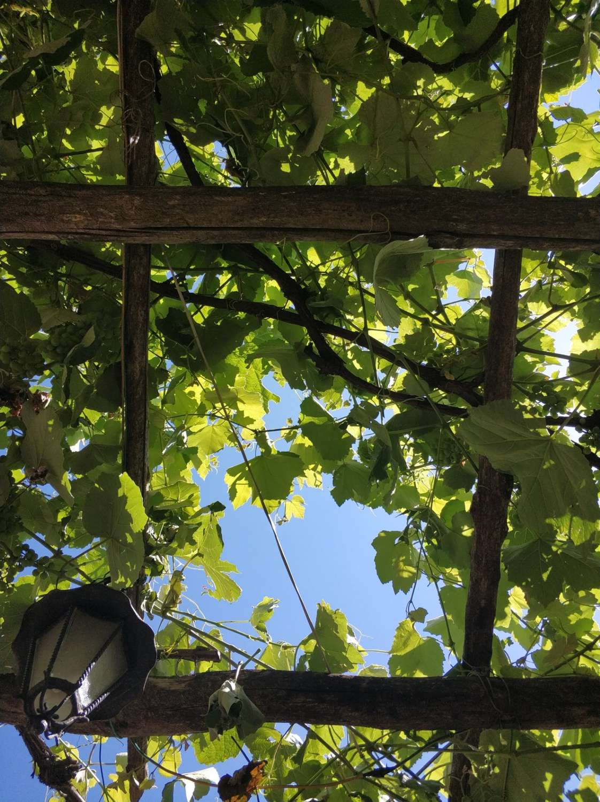

Our 3 day break turned into 7. It could have easily turned into a lifetime. 

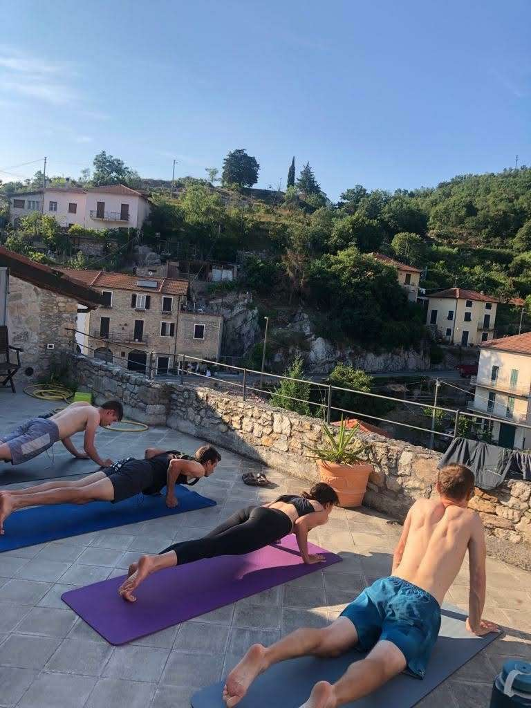

I celebrated my birthday in the only way we knew how to - a birthday ride.

<iframe src="https://ridewithgps.com/embeds?type=trip&id=60753069&title=Colle%20di%20Caprauna%20Birthday%20Ride&metricUnits=true&sampleGraph=true&privacyCode=e0whdQI9TBrzr9lQ" style="width: 1px; min-width: 100%; height: 700px; border: none;" scrolling="no"></iframe>

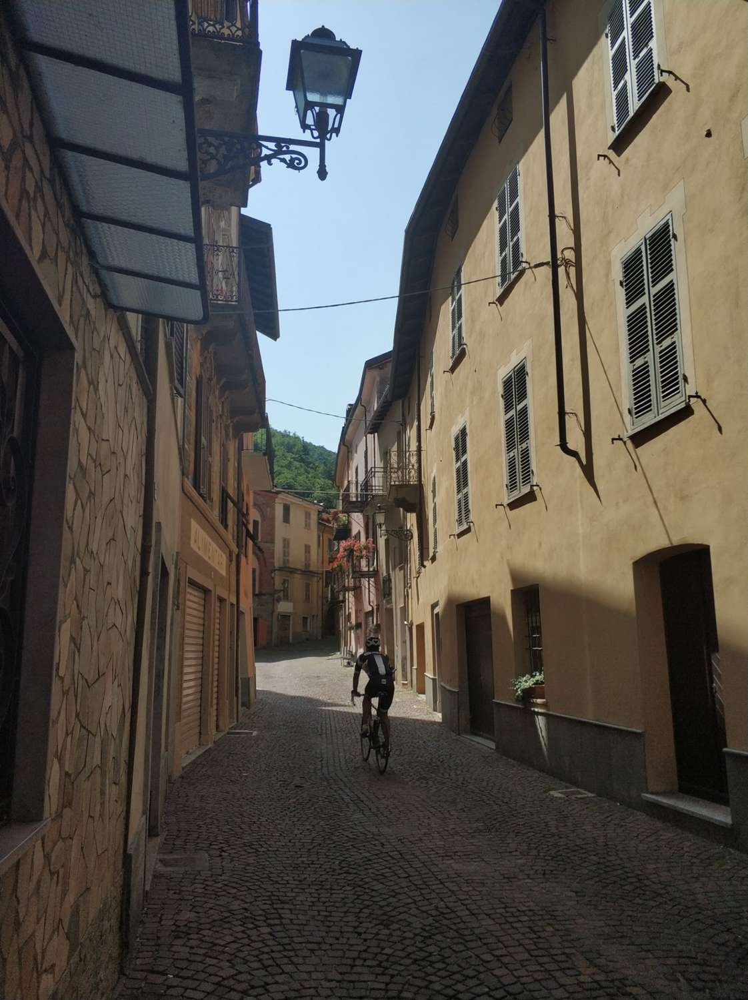

## Day 6: Castelvecchio di Rocca Barbena - Celle

<iframe src="https://ridewithgps.com/embeds?type=trip&id=60752993&title=%20Day%206%3A%20Castelvecchio%20di%20Rocca%20Barbena%20-%20Celle&metricUnits=true&sampleGraph=true&privacyCode=XqPoen1fbg2cArTp" style="width: 1px; min-width: 100%; height: 700px; border: none;" scrolling="no"></iframe>

All things in life must end. Thankfully, and hopefully, the bad things. But unfortunately, also the good things. Our friend was right, it was the best bar in the world.

The end of a good thing can be the start of another. In this case, Francesco's grandma lives just down the hill (ok, almost 70km away) on the coast. Our descent and flat was filled with more beauty.

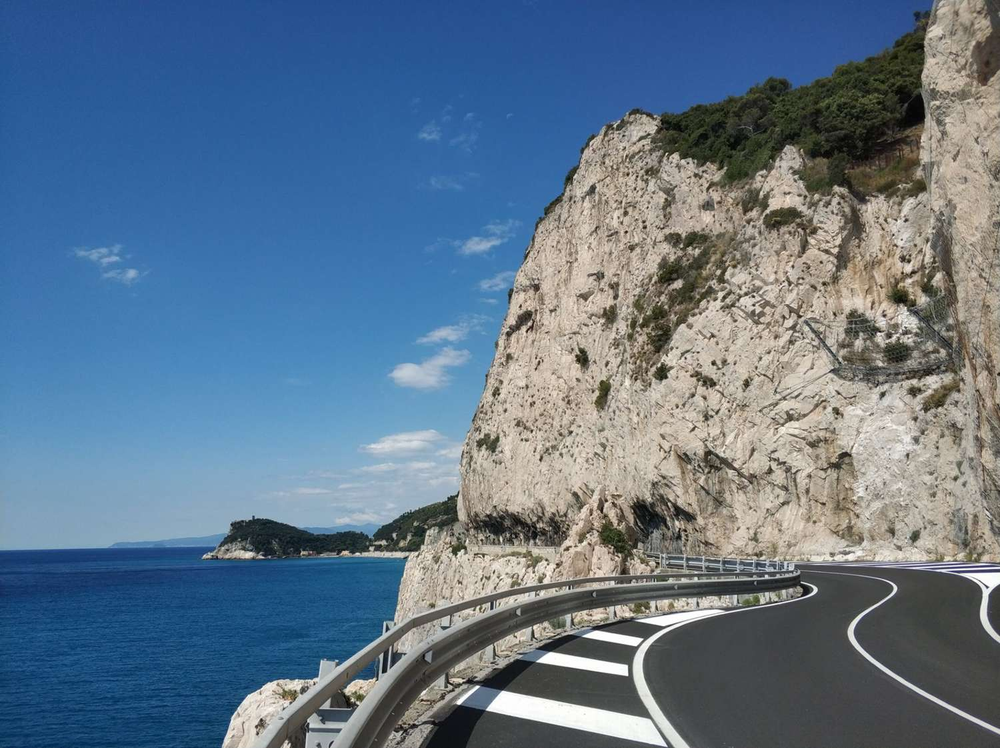

And food. And coffee.

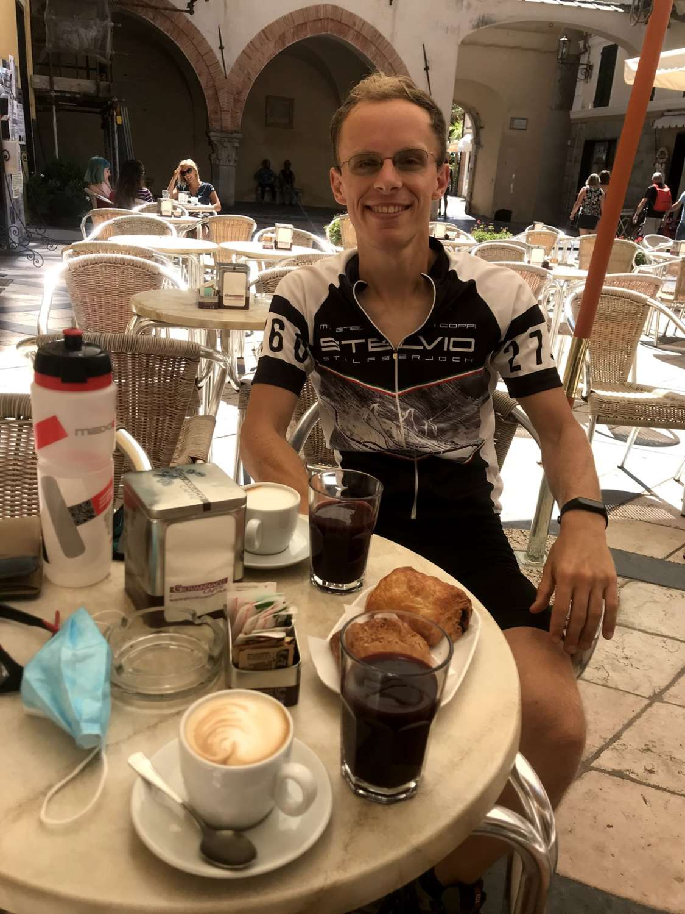

Who knew the sea could be so blue?

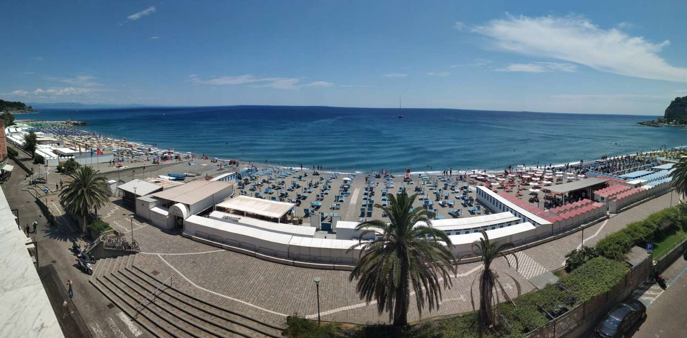

### Notes

```markdown
- Our quick pit stop in Castelvecchio turned into a week of pure joy and recovery, both mentally and physically. Still, we managed to get in a 87 km ride with 2300+ meters of elevation for Will's birthday, together with Michele. 
- We descended towards Celle passing through Balestrino and Capo Noli
- We arrived in Celle for lunch and for a swim - chilling with Nonna 
```

## Day 7: Celle - Genova

<iframe src="https://ridewithgps.com/embeds?type=trip&id=60752992&title=Day%207%3A%20Celle%20-%20Genova&metricUnits=true&sampleGraph=true&privacyCode=5tyziRvNuXyK3FVa" style="width: 1px; min-width: 100%; height: 700px; border: none;" scrolling="no"></iframe>

The last day was our shortest day as well, as only 36km separated us from the end of an amazing adventure. There is no triumphant *defy all odds and succeed* end story here. We knew we would make it, but just weren't sure if we would make it in time for lunch.

While the first part of the ride was nice, along the coast on nice bike paths, the second half was urban cycling, hence the lack of photos. But never did city biking feel like such an accomplishment.

### Notes

```markdown
- Nice ride for the first half on the cycling way next to the sea and then some traffic dodging 
- With the end in sight, we raced through traffic to get to Francesco's home town and finish the journey (actually, only half of it)
```

## Conclusion

This was truly a ride of a lifetime, as we could explore three countries in less than a week (if you don't count our week-long break). The trip had it all - mountains, sea, forests, gelato, wild exposed camping, beaches, gelato, good food, and more gelato. Every other aspect of cycling in Italy made up for the sub-optimal roads, while France was a different kind of cycling perfection.

We were exhausted at the end... but not done. The trip was so good that we decided to do another one, just a few days after, through central Italy. More on that next time.

*Note: This trip took place in July 2020 and was written in the fall and winter of 2020/2021.*