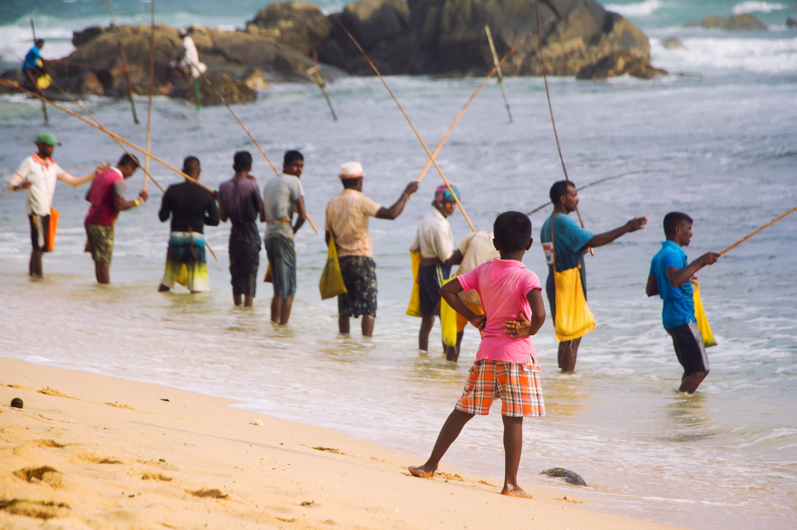
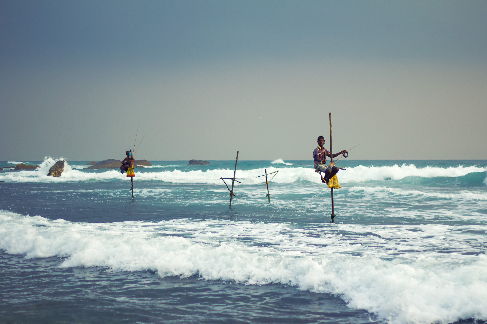
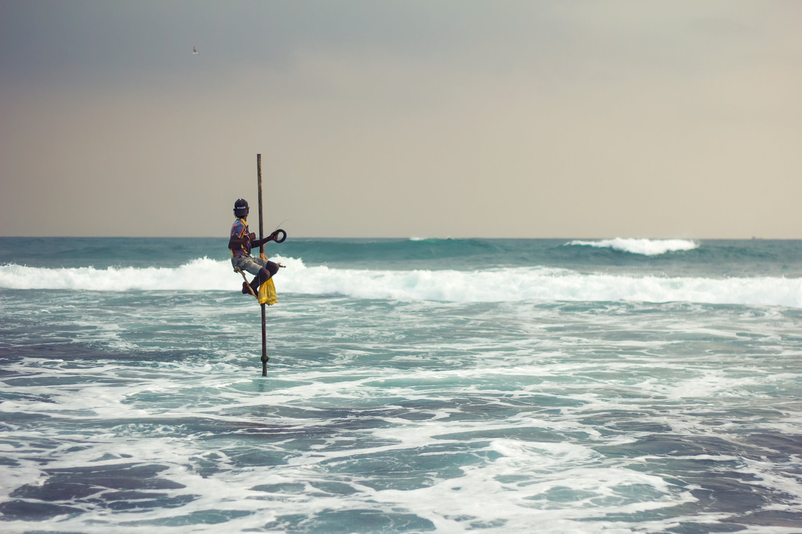
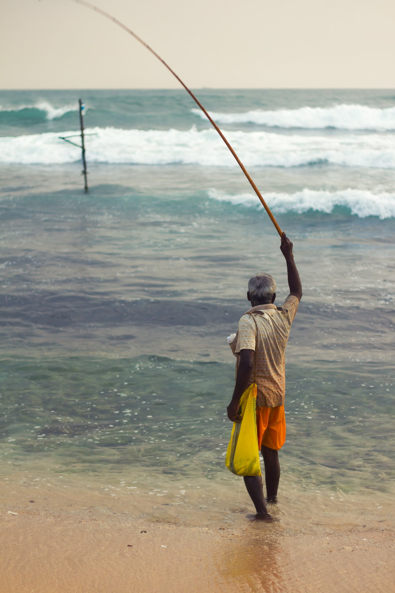
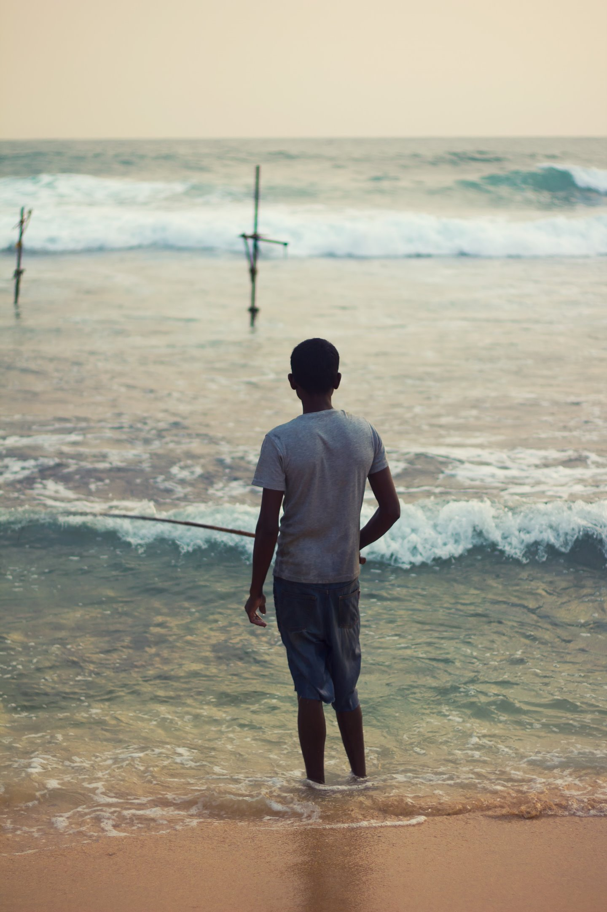
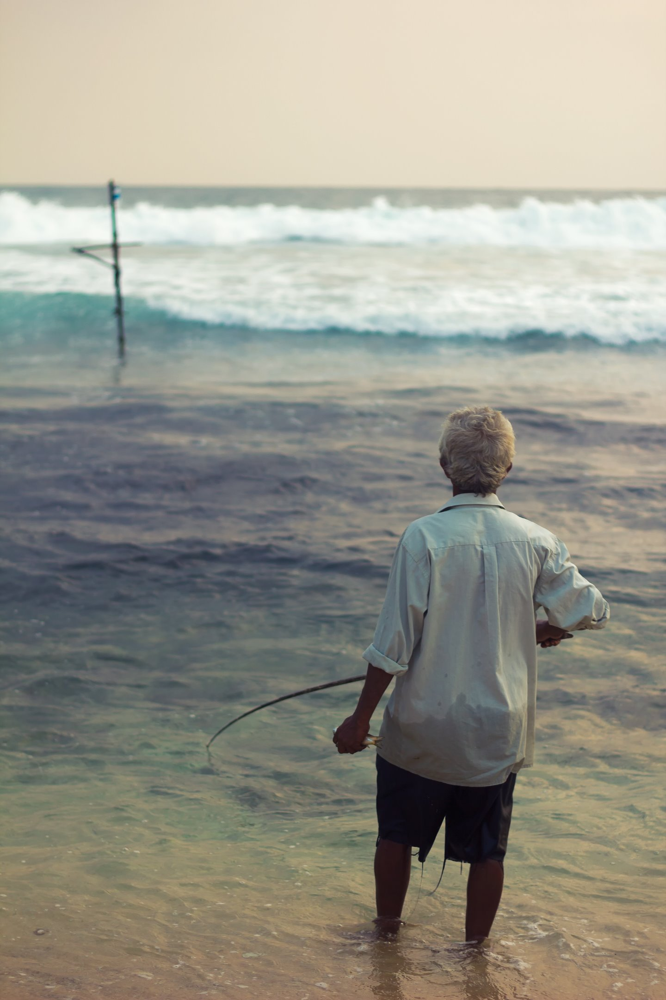
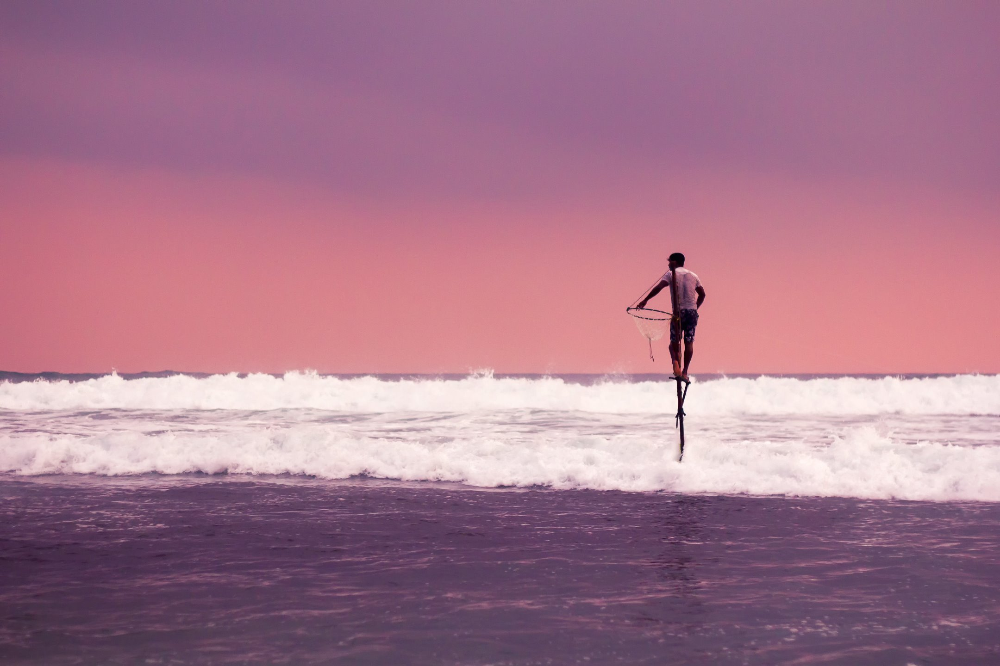

Description of this tradition...

### The Back Story

Some text about it.

#### Heading 4

##### Heading 5

###### Heading 6

# Something else

## Here's a bike ride I went on recently

### Strave

<iframe height='405' width='590' frameborder='0' allowtransparency='true' scrolling='no' src='https://www.strava.com/activities/3350453996/embed/cf714a05591b5199c99052676a2afb4726757914'></iframe>

### Ride with GPS

<iframe src="https://ridewithgps.com/embeds?type=trip&id=47569877&title=Earth%20Day%20Run&metricUnits=true&sampleGraph=true" style="width: 1px; min-width: 100%; height: 700px; border: none;" scrolling="no"></iframe>

### Komoot

<iframe src="https://www.komoot.com/tour/166997742/embed?profile=1&gallery=1" width="100%" height="580" frameborder="0" scrolling="no"></iframe>

